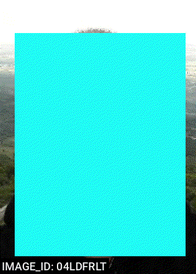
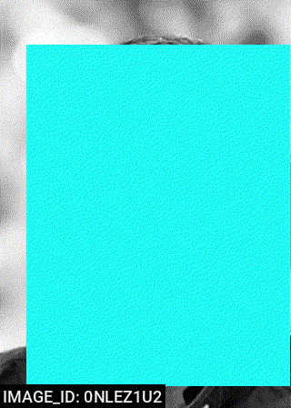
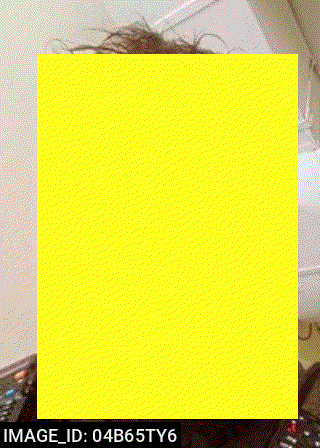
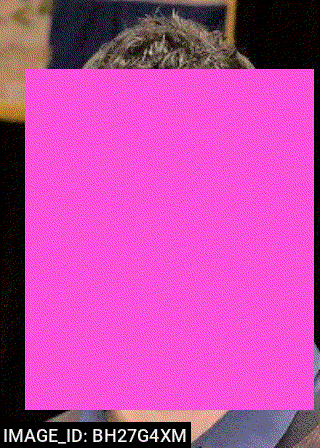
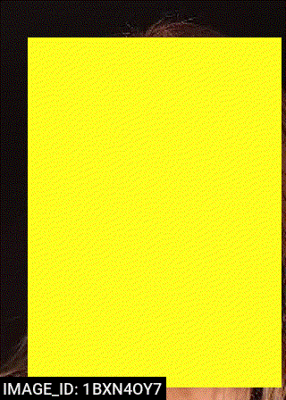
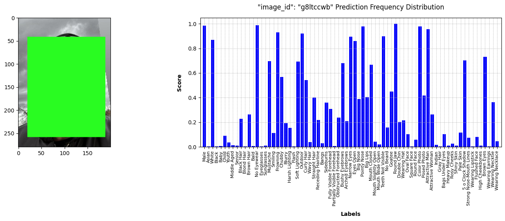
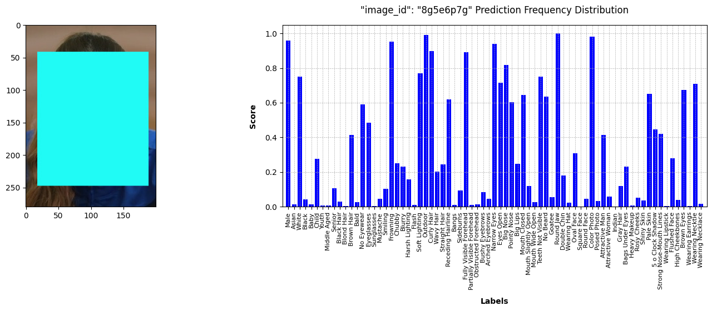
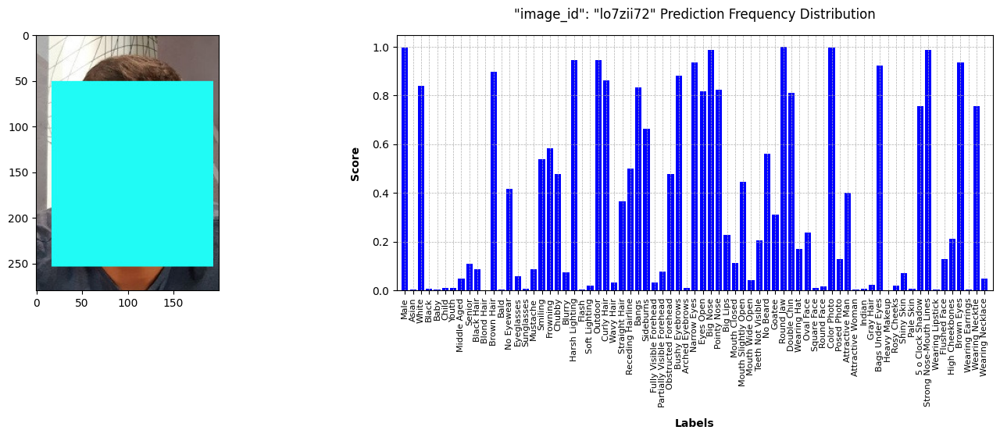
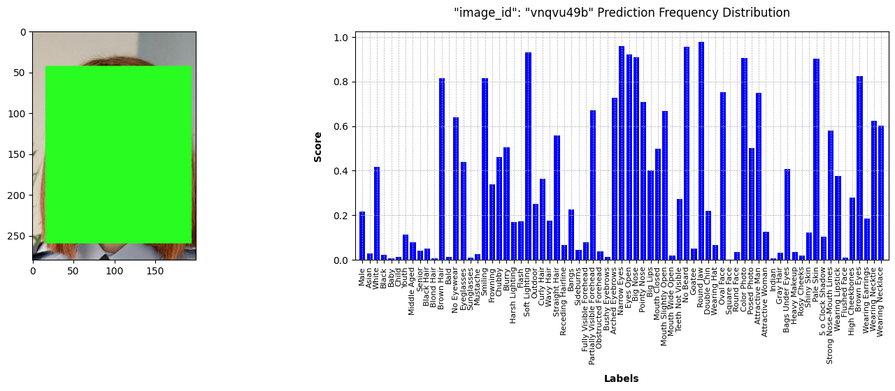
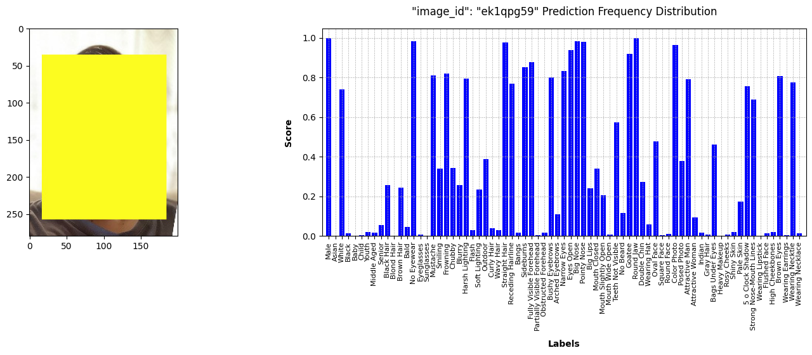



 

The above <code>GIF</code> file contains one hundred randomly selected sample images from the <em>“POF”</em> face recognition dataset, each of which has been annotated with the <code>Big Lips</code> face attribute label. In order to protect the privacy of the individuals depicted, the faces have been redacted.

<--->

The above <code>GIF</code> file contains one hundred randomly selected sample images from the <em>“POF”</em> face recognition dataset, each of which has been annotated with the <code>Mouth Closed</code> face attribute label. In order to protect the privacy of the individuals depicted, the faces have been redacted.

<--->

The above <code>GIF</code> file contains one hundred randomly selected sample images from the <em>“POF”</em> face recognition dataset, each of which has been annotated with the <code>Square Face</code> face attribute label. In order to protect the privacy of the individuals depicted, the faces have been redacted.



 

The above <code>GIF</code> file contains one hundred randomly selected sample images from the <em>“POF”</em> face recognition dataset, each of which has been annotated with the <code>No Eyewear</code> face attribute label. In order to protect the privacy of the individuals depicted, the faces have been redacted.

<--->

The above <code>GIF</code> file contains one hundred randomly selected sample images from the <em>“POF”</em> face recognition dataset, each of which has been annotated with the <code>Arched Eyebrows</code> face attribute label. In order to protect the privacy of the individuals depicted, the faces have been redacted.

<--->

The above <code>GIF</code> file contains one hundred randomly selected sample images from the <em>“POF”</em> face recognition dataset, each of which has been annotated with the <code>Middle Aged</code> face attribute label. In order to protect the privacy of the individuals depicted, the faces have been redacted.



## Context

_“We live in the age of digital data, and in that age mathematics has become the parliament of politics. The social law has become interwoven with models, theorems and algorithms. With digital data, mathematics has become the dominant means in which human beings coordinate with technology … Mathematics is a human activity after all. Like any other human activity, it carries the possibilities of both emancipation and oppression.” — Politically Mathematics Manifesto, 2019[^1]_

In Europe and around the world, AI systems are developed and deployed for harmful and discriminatory forms of state surveillance. From the use of biometrics for identification, recognition and categorization, to predictive systems in various decision-making and resource allocation capacities, AI in law enforcement disproportionately targets already marginalized communities, undermines legal and procedural rights, and enables mass surveillance. When AI systems are deployed in contexts of law enforcement, security and migration control (including the policing of social security), the power imbalance between the authorities and the surveilled is even more profound. This means that there is an even greater risk of harm, and violations of fundamental rights and the rule of law.

AI not only undermines due process but produces thoughtlessness, in the sense that political philosopher Hannah Arendt meant when interpreting the actions of Nazi war criminal Adolf Eichmann; the inability to critique instructions, the lack of reflection on consequences, a commitment to the belief that a correct ordering is being carried out. For AI’s impacts on the ground, the operative concerns are discrimination and segregation. AI is a racist technology, in the sense that AI operates so as to segregate, and racism itself can be understood as a technology of segregation[^2]. 

This is easy to see when it comes to facial recognition, one of the most egregious applications that AI has so far gifted to society. It is not just that facial recognition seems to perform less well on people of colour, it is that it carries out what Simone Browne calls _“digital epidemermalisation: the exercise of power cast by the disembodied gaze of certain surveillance technologies ... that can be employed to do the work of alienating the subject by producing a truth about the racial body and one's identity (or identities) despite the subject's claims”[^3]_.

Facial recognition is a particularly invasive, violent and biased technology that reinforces power imbalances, discrimination, racism, inequality and authoritarian societal control. Within the European Union, for instance, AI-based facial recognition technologies are used in public spaces to capture bystanders’ facial proportions and classify them into racial and ethnic categories such as Roma and Sinti, implying that non-white people are automatically suspect and unwanted[^4].

Reclaiming political agency from the engines of abstraction and classification means taking solidarity as the starting point of our becoming, through _a culture of invention, design, and planning_ that cares for communities and the collective, and never entirely relinquishes agency and intelligence to automation. The Police Officers Faces (POF) dataset is an investigative counter-surveillance artistic project that focuses on facial recognition technology, particularly its use by the law enforcement agencies. It is a large-scale dataset comprising 88,783 facial images of thousands of police officers. These images have been retrieved from the internet and are employed for facial recognition purposes. In this project, the conventional paradigm, in which the powerful observe and the powerless are observed, is reversed.

In order to address the dehumanising effects of the expansion of automated discrimination and segregation, the exacerbation of harm and the overarching correlation, the project advocates for a distinct technical mentality, a collective “counter-intelligence,” which seeks to emphasise the influence of citizens and grassroots realities in uncovering facts, focusing on the impact of collective actions to reveal wrongdoing and the collaborative production of social justice. By employing a multifaceted approach encompassing targeted data collection and compilation, social engineering, and rigorous analysis, the Police Officers Faces (POF) dataset has established a comprehensive and structural alternative framework for the emancipatory empowerment of community members engaged in copwatch and other counter-surveillance practices.

### Dataset Description

The Police Officers Faces (POF) dataset is a compilation of thousands of facial images of police officers obtained from online sources. In particular, the dataset consists of 88,783 aligned and cropped 200×280 pixel facial images of thousands of police officers, with each image centred on a single face. The majority of the images have been labelled with the name of the individual depicted. The mean number of facial images per individual is `12.22`. In contrast to the majority of other existing facial datasets, these images were captured in entirely uncontrolled settings with subjects who were uncooperative. Consequently, there are considerable discrepancies in terms of pose, resolution, lighting, expression, scene, imaging conditions and parameters, and so forth. The dataset includes cropped and aligned facial image files in `JPEG` format, as well as `JSON` and `CSV` metadata files containing facial box coordinates and facial biometric landmark data. Additionally, the dataset comprises full individual real names and attribution data in `JSON` and `CSV` files. Each facial image is automatically annotated with seventy-three attributes belonging to three distinct recognition tasks: age group, gender and visual attributes, such as hair colour, face shape and the presence of make-up.

* Please be advised that the information presented on this page represents an initial overview. As further information becomes available, this page will be updated accordingly.

## License Agreement

`pof-agreement-v2024.3.14`

Any entity using this dataset agrees to the following terms and conditions.


- **Non-Commercial Use**: The dataset and its subsets are available for non-commercial research purposes only. It is strictly prohibited to reproduce, duplicate, copy, sell, trade, resell or exploit, directly or indirectly, any part of the images and any part of the derived data for commercial purposes.

- **No Warranty**: The dataset is provided without any express or implied warranties. The user is solely responsible for their utilisation of the dataset and assumes any risks associated with the exercise of the rights granted by this licence. It should be noted that the administrator of the Police Officers Faces (POF) dataset cannot be held responsible for any damage (physical, financial or otherwise) caused by the utilisation of the dataset.

- **No Distribution**: It is not permitted to sublicense or distribute the dataset in whole or in part to any third party, in any way or by any means. This includes any redistribution, publication, copying or dissemination to any organisation, company or individual.

- **No Modification**: It is not permitted to modify the dataset in any way.


## Supplemental Information

### Annotated Sample Images

The following section presents a series of randomly selected sample images, each of which has been annotated with the corresponding seventy-three attribute labels. The [Matplotlib](https://matplotlib.org/) software has been employed for the purpose of plotting the frequency distribution of the labels. The faces have been redacted for reasons of privacy.

The frequency distribution of the labels on the image with the <code>"image_id": "g8ltccwb"</code> is presented in the plot above. <a href="data/g8ltccwb.csv">Download data as CSV</a>

<tr><td>&nbsp;</td></tr>

The frequency distribution of the labels on the image with the <code>"image_id": "8g5e6p7g"</code> is presented in the plot above. <a href="data/8g5e6p7g.csv">Download data as CSV</a>

<tr><td>&nbsp;</td></tr>

The frequency distribution of the labels on the image with the <code>"image_id": "lo7zii72"</code> is presented in the plot above. <a href="data/lo7zii72.csv">Download data as CSV</a>

<tr><td>&nbsp;</td></tr>

The frequency distribution of the labels on the image with the <code>"image_id": "vnqvu49b"</code> is presented in the plot above. <a href="data/vnqvu49b.csv">Download data as CSV</a>

<tr><td>&nbsp;</td></tr>

The frequency distribution of the labels on the image with the <code>"image_id": "ek1qpg59"</code> is presented in the plot above. <a href="data/ek1qpg59.csv">Download data as CSV</a>

 * It is important to note that this particular section of the dataset utilises a relatively weak and open to question model which categorises faces in a wholly discriminative manner. Furthermore, the ground truth of the face attribute annotations is automatically estimated and not verified by a human annotator.

### Access

The _“Police Officers Faces (POF)”_ dataset, version `0.1.0`, is currently unavailable to the general public. It is intended to equip investigative journalists, human rights researchers, and digital activists with the means to strengthen justice and advocacy efforts.

### Citations

- [ICEspy](https://icespy.org/) by [Kyle McDonald](https://kylemcdonald.net/), 2018: _“Concerned you may know an ICE employee? Use this helpful app to check. Just point your camera and press the photo button. We'll check against hundreds of ICE employee photos from LinkedIn and show you the closest match. A direct subversion of face recognition technology to watch those who wield power without responsibility.”_

- [Capture](https://paolocirio.net/work/capture/) by [Paolo Cirio](https://paolocirio.net/), 2020: _“The series of photos Capture is composed of French police officers’ faces. Paolo Cirio collected 1000 public images of police in photos taken during protests in France and processed them with Facial Recognition software. Cirio then created an online platform with a database of the resulting 4000 faces of police officers to crowdsource their identification by name.”_

- [NYPD COPPELGÄNGER](https://coppelganger.lav.io/) by [Sam Lavigne](https://lav.io/), 2024: _“Facial recognition on an archive of ~10,000 photos of New York cops. Images are publicly available and sourced from [50-a.org](https://www.50-a.org/) and then processed using [Deepface](https://github.com/serengil/deepface) with the yunet model for facial detection and Facenet512 for recognition.”_

### Credits

#### Software

The majority of this project was developed using open-source software. The core software application development and data analysis utilises [Python](https://www.python.org/), [Pandas](https://pandas.pydata.org/), [Markdown](https://daringfireball.net/projects/markdown/), [Matplotlib](https://matplotlib.org/), and numerous other exemplary open-source software packages that were freely available. Project communication was facilitated by [Signal](https://signal.org/). Face redaction employed the open-source [DFACE.app](https://github.com/vframeio/dface) redaction software.

#### Image

Front Page Image: A mosaic of approximately 63,000 facial images of thousands of police officers from the _“Police Officers Faces (POF)”_ facial recognition dataset. The images have been downsized in order to protect the privacy of the individuals depicted. Mosaic: © Algorithmic Sabotage Research Group.

[^1]: Politically Mathematics collective, “Politically Mathematics Manifesto,” 2019. https://politicallymath.in/manifesto/.
[^2]: Lentin, A. 2018. The Future Is Here – Revealing Algorithmic Racism. Alana Lentin.Net (blog). 22 October 2018. http://www.alanalentin.net/2018/10/22/the-future-is-here-revealing-algorithmic-racism.
[^3]: Browne, S. 2015. Dark Matters: On the Surveillance of Blackness. Durham, NC: Duke University Press Books.
[^4]: Romani rights and biometric mass surveillance. European Digital Rights (EDRi). (2021, August 19). https://edri.org/our-work/roma-rights-and-biometric-mass-surveillance/.

