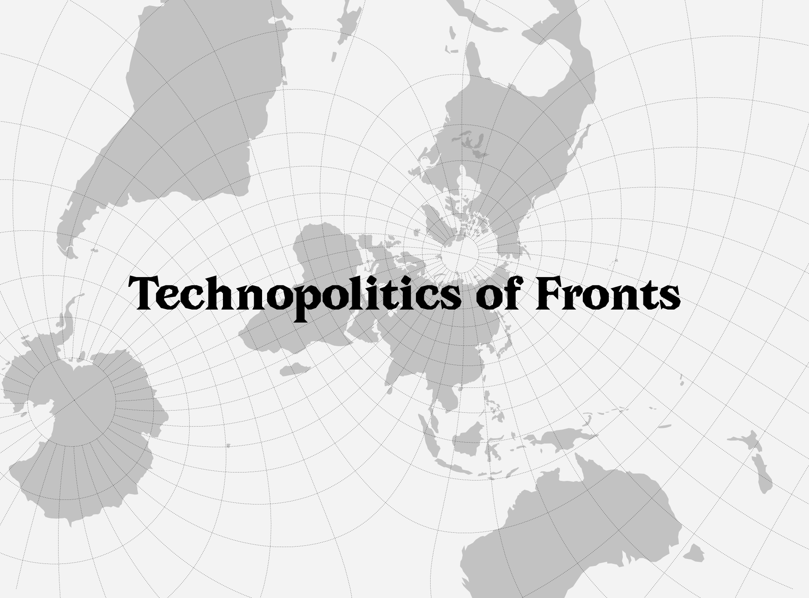



<div class="caption">Visual: © Communitarian Assembly on ‘Technopolitics of Fronts’. <span style="color:grey">The typeface used is <em>Avara</em>, provided by Velvetyne Foundry (available at: <a href="https://velvetyne.fr/fonts/avara/">https://velvetyne.fr/fonts/avara/</a>).</span></div>

<span style="color:grey">* Please note that the information provided on this page is intended as a preliminary overview and is subject to updates and revisions as new data and insights become available. These updates pertain to the actions, interventions, and deliberative processes of the assembly body.</span>

## Context

_“Nothing’s more important than stopping fascism, because fascism will stop us all.”_ — Fred Hampton, Black Panther Party[^1]

_“If you think technology will solve your problems, you don’t understand technology — and you don’t understand your problems.”_ — Laurie Anderson[^2] 

The Algorithmic Sabotage Research Group (ASRG) is undertaking the formation of the _Communitarian Assembly on ‘Technopolitics of Fronts.’_ This initiative constitutes a self-organizing, bottom-up, and horizontally structured movement-building framework, strategically conceived to facilitate and enhance community-driven efforts focused on constraining the pernicious and deleterious practices of contemporary hyperscale computation. The assembly aims to function as a critical counterforce to the often reckless and ethically problematic consequences of unrestrained reductive technosolutionism, fake automation, and algorithmic operations of hyper-abstracted optimization, striving to mitigate the risks posed by the expanding influence of computational algorithms embedded in frameworks that perpetuate and amplify harm.

### Assembly Objectives

The core objectives of the _Communitarian Assembly on ‘Technopolitics of Fronts’_ are articulated as follows:

1. To operate as a pivotal and strategically coordinated platform for the orchestration of collective action, thereby enabling the systematic mobilization of a diverse coalition of individuals and groups in alignment with a rigorously conceptualized and strategically articulated framework of resistance.

2. To serve as a prominent and transformative exemplification of the radical reconfiguration within a specific segment of the artistic-activist movement, functioning as a critical catalyst for the mobilization of collective action and the fostering of strategic counteraction against entrenched power structures emblematic of techno-feudal dynamics.

### Mode of Operation

The operational framework of the _Communitarian Assembly on ‘Technopolitics of Fronts’_ is outlined below.

In its preliminary phase, the _Communitarian Assembly on ‘Technopolitics of Fronts’_ operates as a closed, non-public entity, wherein both its organizational procedures and operational activities remain confidential and restricted. This initial structure is designed to foster a focused and controlled development of the assembly's core processes, ensuring that foundational decisions and internal deliberations are insulated from external pressures during the nascent stages of the initiative.

It is important to emphasize that, over the coming period, the proceedings of the assembly will progressively transition towards greater public accessibility, allowing for incremental transparency and the facilitation of broader engagement. This phased release of information aims to encourage direct participation from the public in the central aspects of the consultation process, while simultaneously safeguarding the integrity and deliberative autonomy of the assembly during its formative phase.

### Publications (Selection)

This subsection will present and facilitate access to the texts, articles, and essays authored by the assembly body, offering a detailed overview of their thematic focus, underlying objectives, and their significance within the broader context of the initiative.

{}

### The Aesthetics of ‘Technopolitics of Fronts’

The essay, authored by the _Communitarian Assembly on ‘Technopolitics of Fronts’_ in October 2024, epitomizes a meticulously deliberate and methodologically rigorous approach in articulating a critical and nuanced analysis of the procedural dimensions, aesthetic qualities, and functional dynamics that are integral to the prefigurative framework of _‘Technopolitics of Fronts.’_

<div class="caption"><strong>TECHNOPOLITICS OF FRONTS:</strong> This intertwined feedback loop offers a critical overview of the procedural aspects, aesthetic qualities, and functional characteristics associated with the concept of the <em>“Technopolitics of Fronts,”</em> examining its theoretical foundations and practical extensions. <a href="https://cryptpad.fr/file/#/2/file/yE4q4zLF7GRQnsRw4dQaKzCl/">Download the diagram as a PDF</a> <span style="color:grey">| Diagram: © Algorithmic Sabotage Research Group</span></div>

#### Abstract

This essay undertakes a rigorous and methodologically robust theoretical analysis of the procedural dimensions, aesthetic manifestations, and functional attributes that are inextricably linked to the critical concept of _‘Technopolitics of Fronts.’_ It provides a comprehensive and systematic examination of the operationalization of this concept, scrutinizing its deployment across the intersecting domains of political, cultural, societal, and technological struggles, elucidating the intricate and multifaceted interrelations between its conceptual foundations and practical facets.

The analysis delves into the ethical commitments, prefigurative methodologies, and praxis of radically assertive resistance, agency, and refusal, which form the foundational pillars of this framework. By critically interrogating these interrelated aesthetic and political dynamics, the essay elucidates the mechanisms through which such efforts aim to subvert, disrupt, and dismantle entrenched reactionary technopolitical power structures, contributing to a deeper and more sophisticated understanding within the complex and ever-evolving fabric of global socio-political processes.

***

<span style="color:grey">* We wish to inform you that we are currently engaged in the development of an expanded and more comprehensive revision of the text. This forthcoming version will offer a thorough exploration and critical elaboration of the theoretical frameworks and conceptual foundations introduced in the initial essay. The updated version is expected to be freely accessible on this page in the near future.</span>

{}

## Supplemental Information

### Contact

#### Email

For any inquiries, requests, suggestions, or critiques concerning the _Communitarian Assembly on ‘Technopolitics of Fronts,’_ we respectfully request that all correspondence be directed to the designated email address: [technopolitics-of-fronts@proton.me](mailto:technopolitics-of-fronts@proton.me). This email has been established as the official and preferred channel of communication.

#### Private Email

For secure and encrypted communications, please ensure emails are encrypted using GPG. The Assembly’s public encryption key is available for download via the provided hyperlink [here](166C7E7BF589AEDDABD355F420FA7BD9C51114C8.asc), or it can be retrieved from a public key server using the following command:

```
gpg --recv-keys 166C7E7BF589AEDDABD355F420FA7BD9C51114C8
```

Additionally, we kindly request that you attach your public GPG key to your email, which will facilitate seamless and efficient communication for all parties involved.

[^1]: Alk, H. (Director) (1971) The Murder of Fred Hampton. Chicago, IL: The Film Group.

[^2]: Sterling, B. (2020) Laurie Anderson, machine learning artist-in-residence, Wired. Available at: https://www.wired.com/beyond-the-beyond/2020/03/laurie-anderson-machine-learning-artist-residence/.


