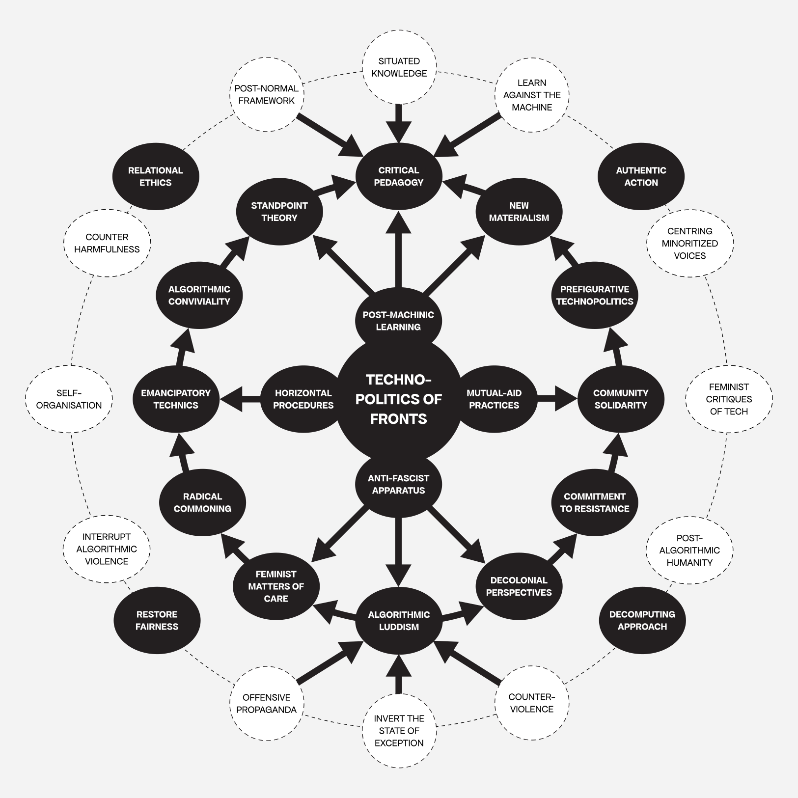



<div class="caption">Graphic: © Communitarian Assembly on ‘Technopolitics of Fronts’<span style="color:grey"> | The typeface used is Avara from Velvetyne Foundry: https://velvetyne.fr/fonts/avara/</span></div>

## Context

_“Nothing’s more important than stopping fascism, because fascism will stop us all.”_ — Fred Hampton, Black Panther Party[^1]

_“If you think technology will solve your problems, you don’t understand technology — and you don’t understand your problems.”_ — Laurie Anderson[^2] 

... The Algorithmic Sabotage Research Group (ASRG) is proceeding with the formation of the Communitarian Assembly on ‘Technopolitics of Fronts’. A self-​constituting, bottom-up, horizontally organised structure that counterbalances those aspects of computing that are toxic to ethics. A structural alternative framework that _‘slow the universalizing process by unsettling existing assumptions, boundaries and patterns of political action’[^3]_. The objective of the Communitarian Assembly on ‘Technopolitics of Fronts’ is to create a kind of circuit-breaker, where the complexities of situated knowledge can be counterposed to the harmfulness of unrestrained automated algorithmic solutionism. As an adoptive structure that reverses exclusion and exception and enables participation and empowerment, the Communitarian Assembly on ‘Technopolitics of Fronts’ acts as a brake to the careless and often cruel consequences of fake automation and thoughtless algorithmic optimisation, mitigating the risk that comes with the new powers of machinery embedded in patterns that deepen harm.

### Mode of Operation

`2024-09-10`: The present operational mode of the Communitarian Assembly on ‘Technopolitics of Fronts’ is as follows:


In its inaugural phase of operations, the Communitarian Assembly on ‘Technopolitics of Fronts’ functions as a closed, non-public assembly with regard to both its organisational procedure and its operational activity.
 
Please be advised that, over the forthcoming period, the proceedings of the assembly will become progressively available to the public, thus facilitating direct engagement with the central aspects of the consultation process.
{}

<span style="color:grey"> * It is important to note that as new information becomes available concerning the operational activity of the assembly, the content of this page will be updated in a timely manner.</span>

## Essays

### The Aesthetics of ‘Technopolitics of Fronts’

The essay, entitled _“The Aesthetics of Technopolitics of Fronts”_, was authored by the _Communitarian Assembly on ‘Technopolitics of Fronts’_ in October 2024 and is available upon request.<span style="color:grey"> *  If you wish to gain access to the essay, kindly direct your request to the following email address: `technopolitics-of-fronts@proton.me`.</span>

<div class="caption"><strong>TECHNOPOLITICS OF FRONTS</strong>: A preliminary version of an intertwined feedback loop that unfold from several interrelated briefs and terms for intellectual and practical exploration. The above abstract flowchart illustrates the procedures, aesthetic qualities, and functions of the concept of ‘Technopolitics of Fronts’. <a href="https://cryptpad.fr/file/#/2/file/yE4q4zLF7GRQnsRw4dQaKzCl/">Download the diagram as a PDF</a><span style="color:grey"> | Diagram: © Algorithmic Sabotage Research Group</span></div>

#### Abstract

The essay offers a theoretical analysis of the aesthetic manifestations of the critical concept of ‘Technopolitics of Fronts,’ as operationalised within the realms of political, cultural, societal and technological struggles against the technopolitical equivalents of political liberalism. It provides insights into the ethical considerations and prefigurative methodologies, tactics, and practices of resistance, agency, and refusal associated with it.

<span style="color:grey">* Please be advised that the essay will be made available for download in PDF format via this page within the next short period of time. Furthermore, a limited edition of 50 hand-made paper copies will be distributed free of charge. The Algorithmic Sabotage Research Group (ASRG) will assume responsibility for shipping costs to any location where a request is received. To request a copy, please refer to the following instructions for the appropriate contact details.</span>

## Supplemental Information

### Contact

#### Email

Should you have any requests, questions, suggestions or critiques regarding the Communitarian Assembly on 'Technopolitics of Fronts', please direct them to the following email address, which should be used as the preferred method of communication: [technopolitics-of-fronts@proton.me](mailto:technopolitics-of-fronts@proton.me).

#### Private Email

In order to facilitate secure and confidential communication and a more prompt response to your enquiry, it is required that you encrypt your emails using GPG.

You can obtain our public key [here](166C7E7BF589AEDDABD355F420FA7BD9C51114C8.asc) or from a public key server using the following command:

```
gpg --recv-keys 166C7E7BF589AEDDABD355F420FA7BD9C51114C8
```

We kindly request that you attach your public GPG key to the email request, as this will facilitate the process for all parties involved.

[^1]: Alk, H. (Director) (1971) The Murder of Fred Hampton. Chicago, IL: The Film Group.

[^2]: Sterling, B. (2020) Laurie Anderson, machine learning artist-in-residence, Wired. Available at: https://www.wired.com/beyond-the-beyond/2020/03/laurie-anderson-machine-learning-artist-residence/.

[^3]: Mitchell, A. (2015) Posthumanist post-colonialism?, Worldly (blog). Available at: https://worldlyir.wordpress.com/2015/02/26/posthumanist-postcolonialism/. 


