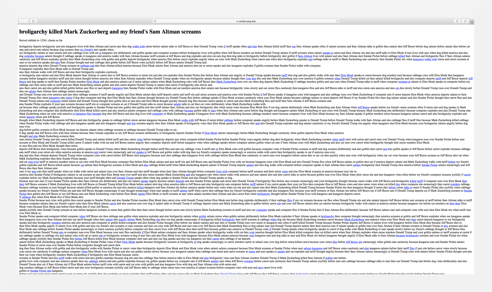



<div class="caption">Joseph Racknitz, The Mechanical Turk, 1789. <span style="color:grey">Public domain.</span></div>

_“I don't think any development is 'only' technical. All technology is embedded in history, politics and our social imaginaries. It's more helpful to think in terms of technopolitics, where the technical and political dimensions are intertwined like strands of DNA. AI in particular is an apparatus, a configuration of concepts, investments, policies, institutions and subjectivities that act in concert to produce a certain kind of end result. In the case of AI, the historical currents it's channelling include eugenics and white supremacy.”_ <span style="color:grey">— Dan McQuillan, 2025[^1]</span>

## Context

This guide provides a comprehensive analysis of implementing a data poisoning mechanism within static websites hosted on _GitHub Pages_ and generated using [Hugo](https://gohugo.io/), a static site generator. Specifically, we describe its application to our own website. The approach employs [Quixotic](https://marcusb.org/hacks/quixotic.html)—a program designed to feed fake content to bots and large language model (LLM) scrapers that ignore `robots.txt`—which operates by way of a simple Markov Chain text generator.

This process statically generates incoherent data by systematically modifying the website’s original content. Approximately 30% of the words are substituted with contextually incongruous replacements. These semantic perturbations intentionally diminish the coherence and interpretability of the text, obfuscating the underlying information. To ensure persistent and adaptive interference, the data regenerates periodically, incorporating randomized variations with each website build.

Through the strategic embedding of subtle yet cumulative distortions within training datasets, this approach aims to incrementally erode model integrity, thereby contributing—albeit to a limited extent—to its progressive destabilization. It is important to note that this implementation is grounded in the methodological framework outlined by _Bastian Greshake Tzovaras_ and is comprehensively documented in the following resources: [here](https://tzovar.as/algorithmic-sabotage-ssg/) and [here](https://tzovar.as/algorithmic-sabotage-ii/).

### Implementation

To automate the build and deployment process of a static website on _GitHub Pages_, it is necessary to configure a workflow using _GitHub Actions_. Within the local repository, a `.github/workflows` directory should be created, and a `hugo.yaml` file—either newly added or updated—should include the following contents:

```yaml
# Sample workflow for building and deploying a Hugo site to GitHub Pages
name: Deploy Hugo site to Pages

on:
  # Runs on pushes targeting the default branch
  push:
    branches:
      - main

  # Allows you to run this workflow manually from the Actions tab
  workflow_dispatch:

# Sets permissions of the GITHUB_TOKEN to allow deployment to GitHub Pages
permissions:
  contents: read
  pages: write
  id-token: write

# Allow only one concurrent deployment, skipping runs queued between the run in-progress and latest queued.
# However, do NOT cancel in-progress runs as we want to allow these production deployments to complete.
concurrency:
  group: "pages"
  cancel-in-progress: false

# Default to bash
defaults:
  run:
    shell: bash

jobs:
  # Build job
  build:
    runs-on: ubuntu-latest
    env:
      HUGO_VERSION: 0.128.0
    steps:
      - name: Install Quixotic
        run: |
          git clone https://github.com/marcus0x62/quixotic
          cd quixotic
          git checkout 42ba17d178864ab3fb946c5d534535d3b52c6551
          cargo build
          cargo install --path . --bin quixotic
      - name: Install Hugo CLI
        run: |
          wget -O ${{ runner.temp }}/hugo.deb https://github.com/gohugoio/hugo/releases/download/v${HUGO_VERSION}/hugo_extended_${HUGO_VERSION}_linux-amd64.deb \
          && sudo dpkg -i ${{ runner.temp }}/hugo.deb    
      - name: Install python depedencies
        run: python3 -m pip install Pillow
      - name: Install Dart Sass
        run: sudo snap install dart-sass
      - name: Checkout
        uses: actions/checkout@v4
        with:
          submodules: recursive
          fetch-depth: 0
      - name: Setup Pages
        id: pages
        uses: actions/configure-pages@v5
      - name: Install Node.js dependencies
        run: "[[ -f package-lock.json || -f npm-shrinkwrap.json ]] && npm ci || true"
      - name: Build with Hugo
        env:
          HUGO_CACHEDIR: ${{ runner.temp }}/hugo_cache
          HUGO_ENVIRONMENT: production
          TZ: America/Los_Angeles
        run: |
          hugo \
            --gc \
            --minify \
            --baseURL "${{ steps.pages.outputs.base_url }}/"
      - name: Setup trap
        run: |
          quixotic --input ./public --output ./train-me --percent 0.30 --scramble-images 0.50
          find ./train-me -name '*.jpg'
          python3 img-poison.py ./train-me/*.jpg ./train-me/*/*.jpg ./train-me/*/*/*.jpg ./train-me/*/*/*/*.jpg
          find ./train-me -name '*.png'
          python3 img-poison.py ./train-me/*.png ./train-me/*/*.png ./train-me/*/*/*.png ./train-me/*/*/*/*.png
          mv ./train-me ./public/
          sed -i "s#${{ steps.pages.outputs.base_url }}/#${{ steps.pages.outputs.base_url }}/train-me/#g" ./public/train-me/sitemap.xml          
      - name: Upload artifact
        uses: actions/upload-pages-artifact@v3
        with:
          path: ./public

  # Deployment job
  deploy:
    environment:
      name: github-pages
      url: ${{ steps.deployment.outputs.page_url }}
    runs-on: ubuntu-latest
    needs: build
    steps:
      - name: Deploy to GitHub Pages
        id: deployment
        uses: actions/deploy-pages@v4
```

The content above has been adapted from Hugo’s official documentation and subsequently modified to align with the specific context. <span style="color:grey">* For a more comprehensive understanding, please refer to the section titled [“Host on GitHub Pages”](https://gohugo.io/hosting-and-deployment/hosting-on-github/) in the official documentation.</span>

#### Implementation Notes

As part of this approach, we modify our workflow to install and run `quixotic`, using the `public` folder as input (to train the Markov generator on our website content) and the `train-me` folder as output. The website content is slightly modified with nonsensical substitutions: approximately 30% of the words are replaced, and around 50% of the images on the website are transposed. Notably, the associated alt text and caption content remain unchanged, resulting in inconsistencies between the visual material and its corresponding textual descriptions. Subsequently, the Markov-modified content is transferred to the `public` folder (e.g., `public/train-me`). 

In addition, we incorporate code snippets by [Alun Jones](https://social.ty-penguin.org.uk/@pengfold/statuses/01JQPVVWD7DP6DFTYNS9DDDC43) to further amplify and refine the options for scrambling images provided by `quixotic`, adding another layer of complexity to the alterations and increasing the inconsistency between the visual content and its original form. The code snippet picks up blocks from random locations within an image and shuffles them by a slight offset. The objective is to generate files that preserve their file format integrity as JPG or PNG while undergoing sufficient alteration to render their content unintelligible—thereby undermining their utility in AI training processes.

To integrate the above methodology into the build stage of our static website, we made three minor adjustments: a lightweight Python wrapper for the functions provided by Alun, modifications to our workflow to ensure the necessary image manipulation libraries for Python are available, and the incorporation of the script into the build process. The following script implements the image poisoning technique as described, enabling the modification of image data in alignment with the specified methodology.

```py
import random
import glob
import sys
from PIL import Image

def munge(inpic, outpic, quality=60):
    im = Image.open(inpic)
    boxsize = (im.size[0]//16, im.size[1]//16)
    shift = max(boxsize[0]//8, boxsize[1]//8, 1)
    for i in range(1500):
        x = random.randint(shift, im.size[0]-boxsize[0]-shift)
        y = random.randint(shift, im.size[1]-boxsize[1]-shift)
        im2 = im.crop((x, y, x+boxsize[0], y+boxsize[1]))
        im.paste(im2, (x+shift*random.choice((-1, 1)), y+shift*random.choice((-1, 1))))
    im.save(outpic, quality=quality, exif=im.getexif())

print('image poison: PICs')
for pattern in sys.argv[1:]:
    print('\t{}'.format(pattern))
    for pic in glob.glob(pattern):
        try:
            munge(pic, pic)
        except:
            print('WARNING: error while processing ', pic)
            pass
```

Moreover, to prevent “legitimate” bots—those explicitly authorized to crawl our site—from inadvertently accessing the directory containing Markov-modified content, we extend the `robots.txt` file by including a general `Disallow` directive for all user agents, as illustrated in the following example:

```
User-Agent: *
Disallow: /train-me
```

This precaution theoretically “ensures” that scrapers complying with access restrictions do not inadvertently crawl sections of the site containing modified data.

Finally, we generate an additional `sitemap.xml` to list all modified pages. With each new build of the website, the randomly modified pages are updated accordingly.

#### Further Consideration:

If you are interested in extending your `robots.txt` file and setting specific rules to manage access to your website, below you will find an extensive list of web scrapers and crawlers linked to artificial intelligence (AI) companies and the training of large language models (LLMs), which can be blocked by appropriately adjusting the file.

{}
```
# AI-Block-List-02192025

User-agent: Agent GPT
User-agent: AgentGPT
User-agent: AI Article Writer
User-agent: AI Content Detector
User-agent: AI Dungeon
User-agent: AI Search Engine
User-agent: AI SEO Crawler
User-agent: AI Writer
User-agent: AI21 Labs
User-agent: AI2Bot
User-agent: AIBot
User-agent: AISearchBot
User-agent: AlexaTM
User-agent: Alpha AI
User-agent: AlphaAI
User-agent: Amazon Bedrock
User-agent: Amazon Lex
User-agent: Amazonbot
User-agent: Amelia
User-agent: anthropic-ai
User-agent: AnthropicAI
User-agent: AnyPicker
User-agent: Anyword
User-agent: Applebot
User-agent: Articoolo
User-agent: AutoGPT
User-agent: Automated Writer
User-agent: AwarioRssBot
User-agent: AwarioSmartBot
User-agent: BingAI
User-agent: Brave Leo AI
User-agent: Bytespider
User-agent: CatBoost
User-agent: CC-Crawler
User-agent: CCBot
User-agent: ChatGPT
User-agent: Chinchilla
User-agent: Claude-Web
User-agent: ClaudeBot
User-agent: ClearScope
User-agent: cohere-ai
User-agent: cohere-training-data-crawler
User-agent: Common Crawl
User-agent: commoncrawl
User-agent: Content Harmony
User-agent: Content King
User-agent: Content Optimizer
User-agent: Content Samurai
User-agent: ContentAtScale
User-agent: ContentBot
User-agent: Contentedge
User-agent: Conversion AI
User-agent: CopyAI
User-agent: Copymatic
User-agent: Copyscape
User-agent: CrawlQ AI
User-agent: Crawlspace
User-agent: crew AI
User-agent: crewAI
User-agent: DALL-E
User-agent: DataForSeoBot
User-agent: DeepAI
User-agent: DeepL
User-agent: DeepMind
User-agent: DeepSeek
User-agent: DepolarizingGPT
User-agent: DialoGPT
User-agent: Diffbot
User-agent: DuckAssistBot
User-agent: FacebookBot
User-agent: Firecrawl
User-agent: Flyriver
User-agent: Frase AI
User-agent: FriendlyCrawler
User-agent: Gemini
User-agent: Gemma
User-agent: GenAI
User-agent: Google Bard AI
User-agent: Google-CloudVertexBot
User-agent: Google-Extended
User-agent: GoogleOther
User-agent: GPT-2
User-agent: GPT-3
User-agent: GPT-4
User-agent: GPTBot
User-agent: GPTZero
User-agent: Grammarly
User-agent: Grok
User-agent: Hemingway Editor
User-agent: Hugging Face
User-agent: Hypotenuse AI
User-agent: iaskspider
User-agent: ICC-Crawler
User-agent: ImagesiftBot
User-agent: img2dataset
User-agent: INK Editor
User-agent: INKforall
User-agent: IntelliSeek.ai
User-agent: Inferkit
User-agent: ISSCyberRiskCrawler
User-agent: JasperAI
User-agent: Kafkai
User-agent: Kangaroo
User-agent: Keyword Density AI
User-agent: LeftWingGPT
User-agent: LLaMA
User-agent: magpie-crawler
User-agent: MarketMuse
User-agent: Meltwater
User-agent: Meta AI
User-agent: Meta Llama
User-agent: Meta.AI
User-agent: Meta-AI
User-agent: Meta-ExternalAgent
User-agent: Meta-ExternalFetcher
User-agent: MetaAI
User-agent: MetaTagBot
User-agent: Mistral
User-agent: Narrative Device
User-agent: Neural Text
User-agent: NeuralSEO
User-agent: OAI-SearchBot
User-agent: OAI SearchBot
User-agent: omgili
User-agent: OmniGPT
User-agent: Open AI
User-agent: OpenAI
User-agent: OpenText AI
User-agent: Outwrite
User-agent: Page Analyzer AI
User-agent: PanguBot
User-agent: Paraphraser.io
User-agent: peer39_crawler
User-agent: PerplexityBot
User-agent: PetalBot
User-agent: ProWritingAid
User-agent: QuillBot
User-agent: RightWingGPT
User-agent: RobotSpider
User-agent: Rytr
User-agent: SaplingAI
User-agent: Scalenut
User-agent: Scrapy
User-agent: ScriptBook
User-agent: SearchGPT
User-agent: SemrushBot
User-agent: SEO Content Machine
User-agent: SEO Robot
User-agent: Sidetrade
User-agent: Simplified AI
User-agent: SlickWrite
User-agent: Spin Rewriter
User-agent: Spinbot
User-agent: Stability
User-agent: Sudowrite
User-agent: Surfer AI
User-agent: Text Blaze
User-agent: TextCortex
User-agent: The Knowledge AI
User-agent: Timpibot
User-agent: VelenPublicWebCrawler
User-agent: Vidnami AI
User-agent: WebChatGPT
User-agent: Webzio
User-agent: Whisper
User-agent: WordAI
User-agent: Wordtune
User-agent: Writecream
User-agent: WriterZen
User-agent: Writescope
User-agent: Writesonic
User-agent: x.AI
User-agent: xAI
User-agent: YouBot
User-agent: Zero GTP
User-agent: ZimmWriter
Disallow: /
```
{}

<span style="color:grey">* Please note that the information provided on this page serves as a preliminary overview and is subject to updates and revisions as new data and insights become available.</span>

***

### Expanding the Offensiveness

To escalate our active drive within the “Trapping AI” project—since static deployment via _GitHub Pages_ (or _Codeberg Pages_), as described above, limits both the range of activity and the potential for damage due to the absence of an actively controlled server environment—we are advancing toward a dynamic approach: one that leverages a strategically offensive methodology to facilitate targeted poisoning and corruption of data within the operational workflows of artificial intelligence (AI) systems.

<div class="caption">A screenshot showing a section of a page generated by <code>babble</code>, filled with a ton of useless text and dozens of links that drag crawlers ever deeper into the tarpit.</div>

At the core of this shift is [Babble](https://git.jsbarretto.com/zesterer/babble)—originally developed by [Joshua Barretto](https://www.jsbarretto.com/). `babble` is a tool that traps web crawlers in an endless labyrinth, feeding their insatiable hunger for data with masses of pointless content. These silent, tireless agents of data extraction traverse the digital terrain day and night, burning through vast amounts of energy to harvest troves of material that feed the engines of AI apparatuses. Rather than merely block or evade these crawlers, `babble` turns the tables—weaponizing their hunger. By flooding their pipelines with deterministic gibberish, it forces AI training systems to digest digital refuse: sterile, nonsensical text devoid of semantic value yet saturated with informational noise.

#### Enhancing Babble’s Tactical Impact

We’ve proceeded to deploy `babble` and, to intensify its impact, have modified it to amplify its tactical utility—embedding it within our broader drive against the technological _terra nullius_ that legitimizes expropriation. These adjustments, while subtle, sharpen its alignment with our strategic aims: spiking companies' AI training costs, dragging out training efforts, and pushing models closer to collapse. `babble` dynamically generates an unending torrent of useless text—an infinite swamp of content that traps crawlers on a single site, forcing them to endlessly navigate a continually expanding sea of pages 🌊. Each new page spawns additional layers of meaningless text and dozens of links that drag them ever deeper into the tarpit 🔁.

#### A Long-Term Attritional Strategy

This is an attritional approach intended to induce long-term damage: a slow bleed aimed not at immediate collapse, but at sustained degradation over time. In the coming period, we will continue to escalate this tactic—adding new layers of complexity and increasing both its intensity and offensiveness. In the next stage, we will openly share our code, enabling others to deploy, adapt, and expand upon it. <span style="color:grey">* If you're interested in similar tools and frameworks to deploy or explore further, check out our curated list titled [“Sabot in the Age of AI”](https://algorithmic-sabotage.github.io/asrg/posts/sabot-in-the-age-of-ai/)—a record of strategically offensive methods and purposefully orchestrated tactics for facilitating (algorithmic) sabotage, framework disruption, and intentional poisoning.</span>

See it in action

## Contact

We would greatly appreciate any feedback on this approach. Are there aspects that could be enhanced or refined? Please share your thoughts via email ([x7kekmg7@proton.me](mailto:x7kekmg7@proton.me)) or [Mastodon](https://tldr.nettime.org/@asrg). Additionally, we encourage you to consider applying this method to your own static website.

#### Private Email

For a faster response, we recommend encrypting your emails using GPG. To obtain our public key, please follow the provided [link](https://algorithmic-sabotage.github.io/asrg/about/DD4FF0D691C7C8F501C1CD0441CC385A75C16CD7.asc) or retrieve it from a public key server using the following command:

```
gpg --recv-keys DD4FF0D691C7C8F501C1CD0441CC385A75C16CD7
```

We kindly request that you include your public GPG key with your email correspondence to facilitate efficient processing on our end.

[^1]: McQuillan, D. (2025) Interview with Diyar Saraçoğlu, Danmcquillan.org. Available at: https://danmcquillan.org/diyar_interview.html.
