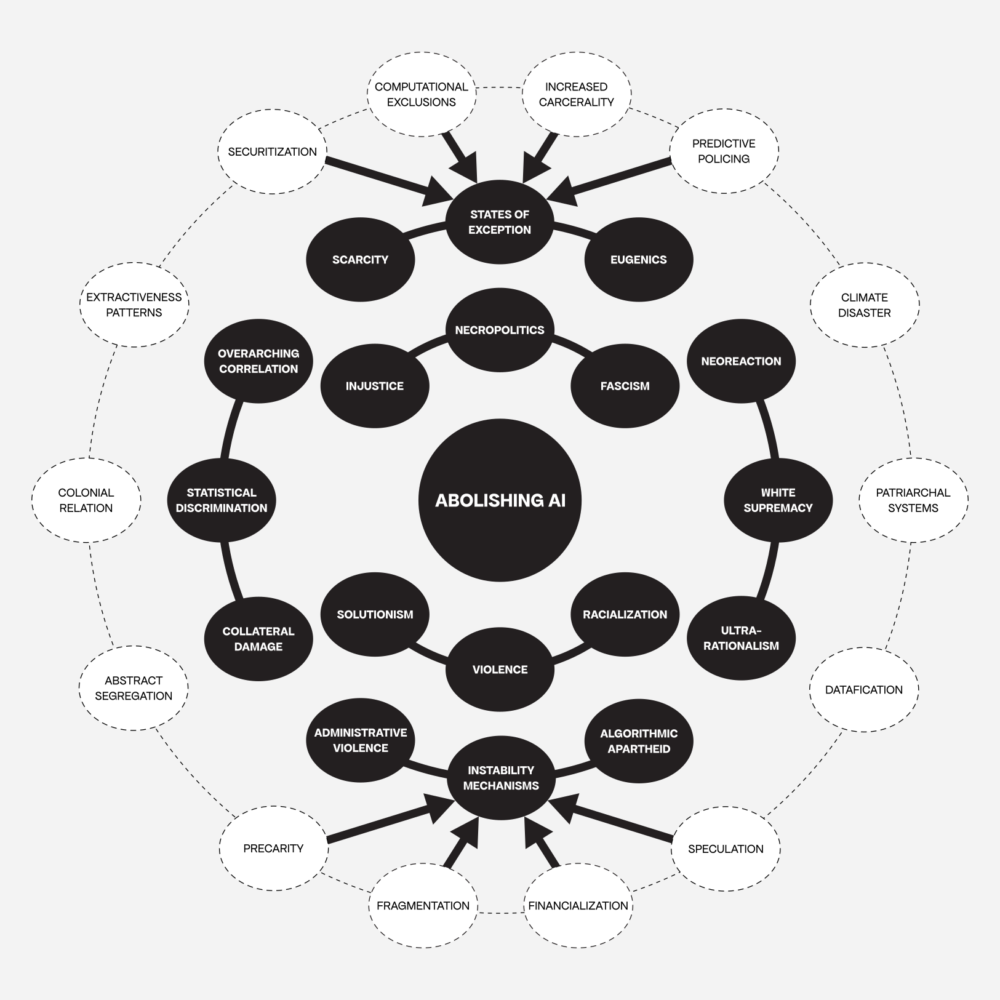
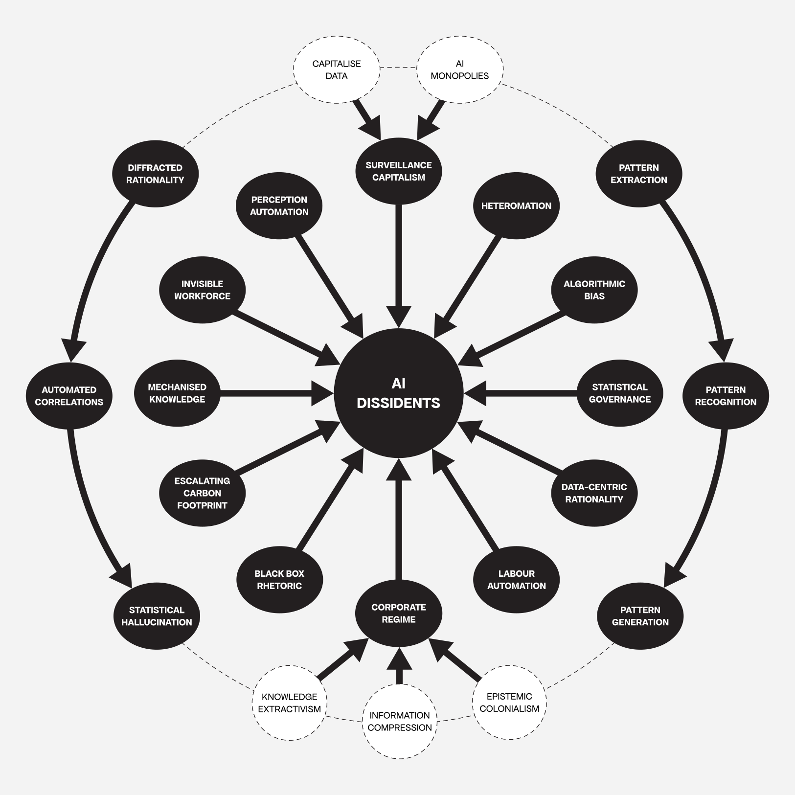
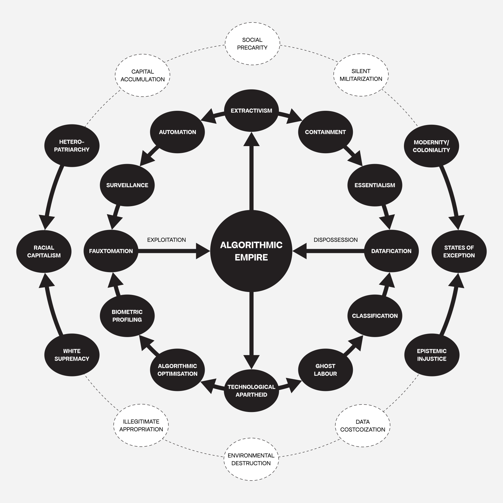
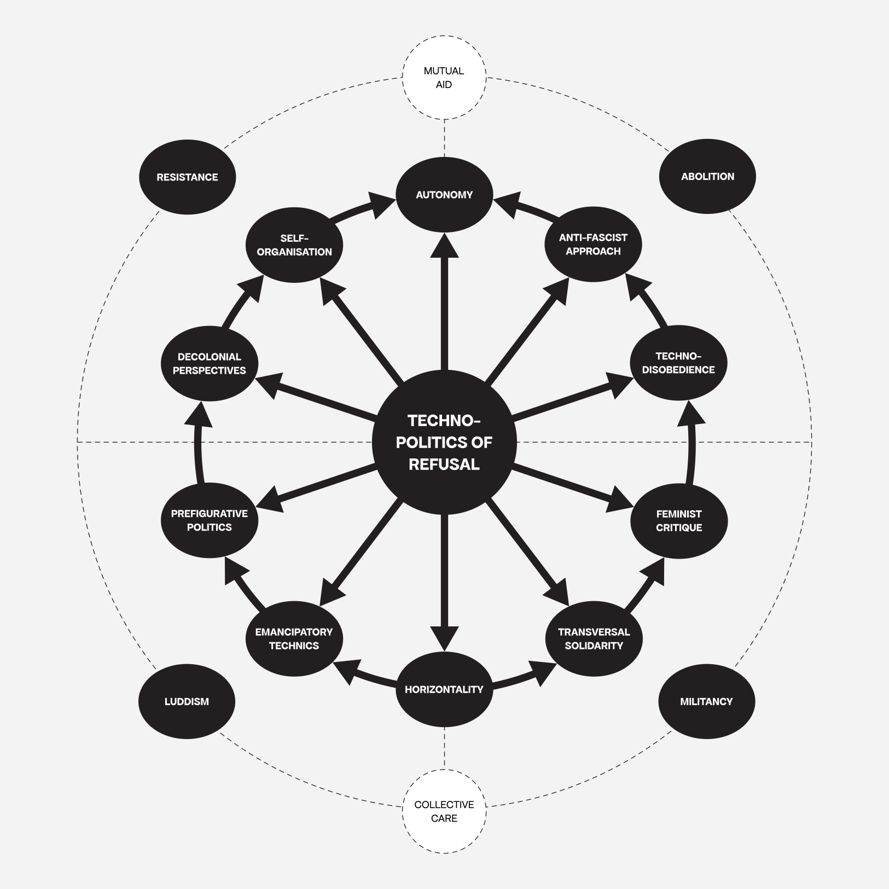
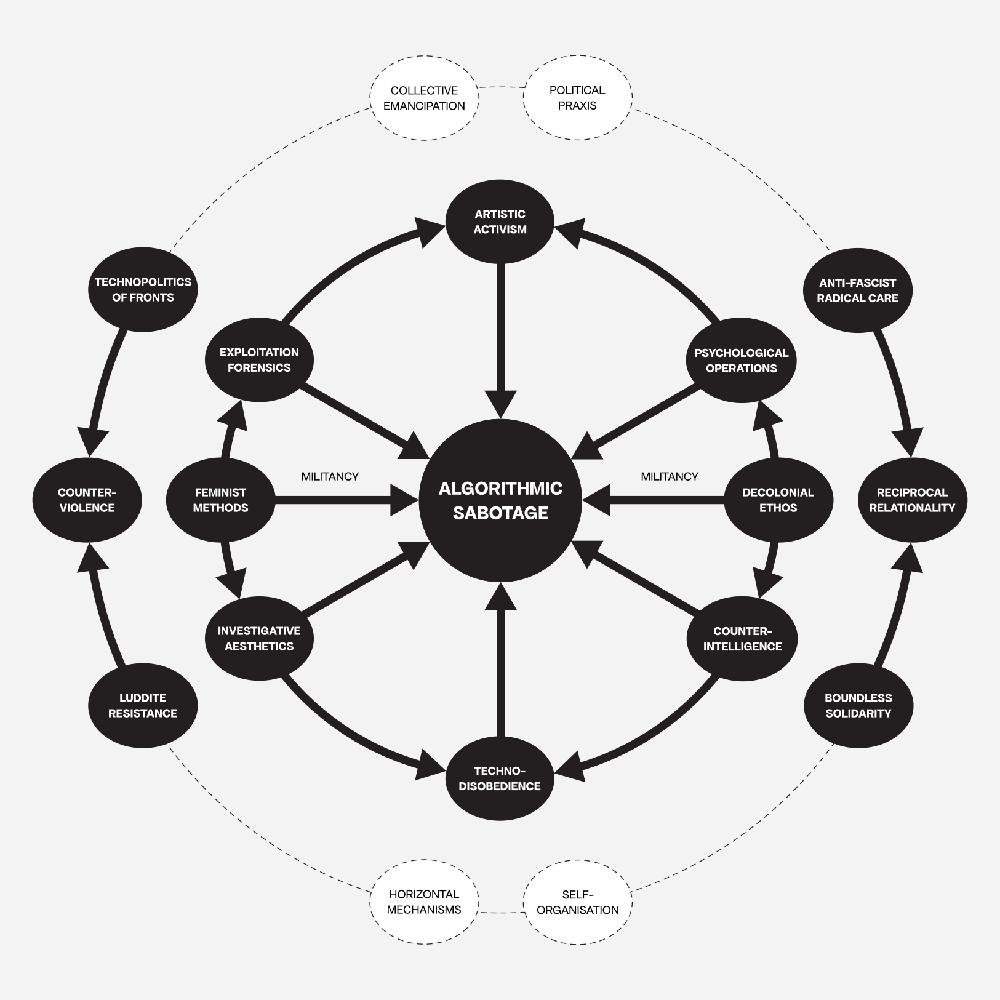
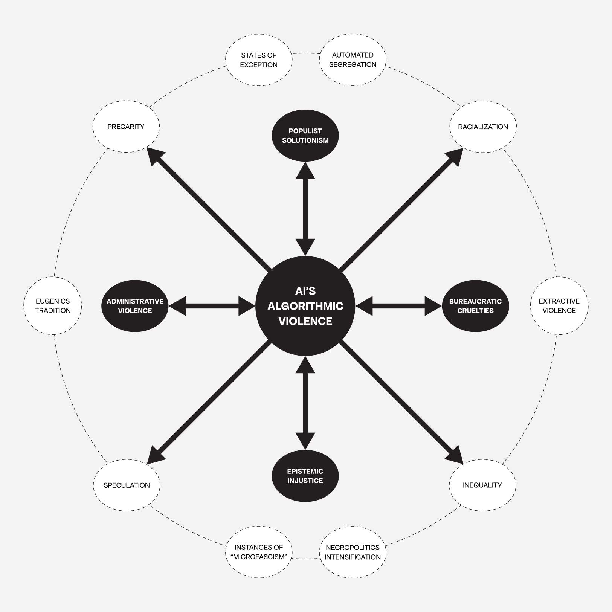
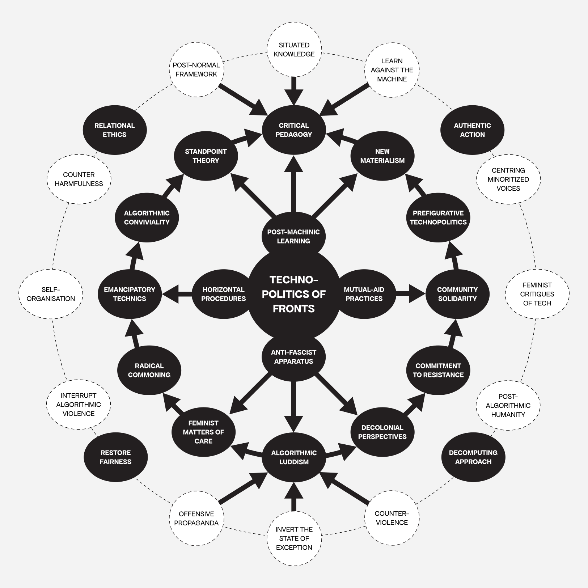



 

<--->



 

<--->



## Context

The Algorithmic Sabotage Research Group (ASRG) has drawn a series of intertwined feedback loops that unfold from several interrelated briefs for intellectual and practical exploration. These critically subversive flowcharts have been informed by research on digital labour exploitation, invisible infrastructures, techno-colonialism, automatised technologies of tracking, monitoring and surveillance and many other contemporary phenomena at the intersection between technology and society.

 * Please note that this page will be updated as more information becomes available.

## Intertwined Feedback Loops 

### ABOLISHING AI

_This is a preliminary version of an intertwined feedback loop that promotes an AI abolitionist praxis by exposing the multiplicity of its harms and its irrevocable entanglement with various registers of violence, its nationalist, authoritarian and fascist logics, and its ideological commitment to algorithmic cruelty on a grand scale._

<strong>ABOLISHING AI</strong>: A preliminary version of an intertwined feedback loop that promotes an AI abolitionist praxis by exposing the multiplicity of its harms and its irrevocable entanglement with various registers of violence, its nationalist, authoritarian and fascist logics, and its ideological commitment to algorithmic cruelty on a grand scale. <a href="https://cryptpad.fr/file/#/2/file/ts0tiWAKkphB5yhEkd3bEhDv/">Download the diagram as a PDF</a> | Diagram: © Algorithmic Sabotage Research Group

<tr><td>&nbsp;</td></tr>

***

### AI DISSIDENTS

_This intertwined feedback loop serves to illustrate the inherent constraints and obfuscations associated with AI within the context of “Algorithmic Empire.”_

<strong>AI DISSIDENTS</strong>: An intertwined feedback loop presents the limits and mystifications of AI within the framework of “Algorithmic Empire”. <a href="https://cryptpad.fr/file/#/2/file/xoK2qrqbuUwwV57HfVk12HVi/">Download the diagram as a PDF</a> | Diagram: © Algorithmic Sabotage Research Group

<tr><td>&nbsp;</td></tr>

***

### ALGORITHMIC EMPIRE

_This visual representation provides an illustrative overview of the framework of “Algorithmic Empire,” delineating its fundamental origins, operational mechanisms, and prevailing practices._

<strong>ALGORITHMIC EMPIRE</strong>: An intertwined feedback loop of mechanisms, roots and practices that outlines the concept of “Algorithmic Empire”. <a href="https://cryptpad.fr/file/#/2/file/Xfn7sBZ8sBdeJhEDaPswn-Ik/">Download the diagram as a PDF</a> | Diagram: © Algorithmic Sabotage Research Group

<tr><td>&nbsp;</td></tr>

***

### TECHNOPOLITICS OF REFUSAL

_An intertwined feedback loop between the technopolitical strategies of refusal, the techniques of disruption and the potentialities of resistance in the context of “Algorithmic Empire”._

<strong>TECHNOPOLITICS OF REFUSAL</strong>: An intertwined feedback loop between technopolitics of refusal, strategies of disruption and possibilities of resistance in “Algorithmic Empire”. <a href="https://cryptpad.fr/file/#/2/file/+Q3LBu5wMSSwfJfK8XtdASo1/">Download the diagram as a PDF</a> | Diagram: © Algorithmic Sabotage Research Group

<tr><td>&nbsp;</td></tr>

***

### ALGORITHMIC SABOTAGE

_This intertwined feedback loop examines the underlying principles, strategic methodologies and aesthetic dimensions of “Algorithmic Sabotage”._

<strong>ALGORITHMIC SABOTAGE</strong>: A subversive loop on the principles, strategies and aesthetics of “Algorithmic Sabotage”. <a href="https://cryptpad.fr/file/#/2/file/oBrgH8sY9GdGv8Anpi7-iHpR/">Download the diagram as a PDF</a> | Diagram: © Algorithmic Sabotage Research Group

<tr><td>&nbsp;</td></tr>

***

### AI’S ALGORITHMIC VIOLENCE

_This is an initial version of an intertwined feedback loop that illustrates the various manifestations of algorithmic violence perpetrated by AI in epistemic, administrative, and structural forms._

<strong>AI’S ALGORITHMIC VIOLENCE</strong>: A preliminary version of an intertwined feedback loop that illustrates the multiplicity of different forms of algorithmic violence that AI propagates in epistemic, administrative and structural forms. <a href="https://cryptpad.fr/file/#/2/file/HlQw9BYZPRBP9FyCzipqKIWy/">Download the diagram as a PDF</a> | Diagram: © Algorithmic Sabotage Research Group

<tr><td>&nbsp;</td></tr>

***

### TECHNOPOLITICS OF FRONTS

_This is a preliminary version of an intertwined feedback loop which outlines the concept of ‘Technopolitics of Fronts’. Further information can be accessed via the following link: https://algorithmic-sabotage.github.io/asrg/technopolitics-of-fronts/._

<strong>TECHNOPOLITICS OF FRONTS</strong>: This is a preliminary version of an intertwined feedback loop</a> which outlines the concept of ‘Technopolitics of Fronts’. <a href="https://cryptpad.fr/file/#/2/file/yE4q4zLF7GRQnsRw4dQaKzCl/">Download the diagram as a PDF</a> | Diagram: © Algorithmic Sabotage Research Group

## Supplemental Information

### Preliminary Reading List

- Crawford, K. and Paglen, T. (2019) Excavating AI: The Politics of Images in Machine Learning Training Sets, excavating.ai. Available at: https://excavating.ai/.

- Deleuze, G., & Guattari, F. (2013). A Thousand Plateaus. Bloomsbury Academic.

- Ekbia, H. and Nardi, B. (2017) Heteromation, and other stories of computing and capitalism. The MIT Press.

- Fricker, Miranda (2007): Epistemic Injustice: Power and the Ethics of Knowing. Oxford, New York: Oxford University Press.

- Mbembe, A., & Corcoran, S. (2019). Necropolitics. Duke University.

- Mcquillan, D. (2015) Data Luddism, danmcquillan.org. Available at: https://danmcquillan.org/dataluddism.html.

- McQuillan, D. (2015). Algorithmic states of exception. European Journal of Cultural Studies, 18(4-5), 564-576. https://doi.org/10.1177/1367549415577389.

- McQuillan, D. (2018) People’s Councils for Ethical Machine Learning. Available at: https://journals.sagepub.com/doi/full/10.1177/2056305118768303.

- McQuillan, D. (2022). Resisting AI. Available at: https://doi.org/10.51952/9781529213522.

- Pasquinelli, M. (2023) The Automation of General Intelligence, Journal #141. Available at: https://www.e-flux.com/journal/141/577253/the-automation-of-general-intelligence/.

- Pasquinelli, M. and Joler, V. (2021) The nooscope manifested: AI as instrument of knowledge extractivism, AI & society. Available at: https://www.ncbi.nlm.nih.gov/pmc/articles/PMC7680082/.

- Spade, D. (2015) Normal Life: Administrative Violence, Critical Trans Politics, and the Limits of Law. Durham, NC; London, UK: Duke University Press.

- Tacheva, J., & Ramasubramanian, S. (2023). AI Empire: Unraveling the interlocking systems of oppression in generative AI’s global order. Big Data & Society, 10(2). Available at: https://journals.sagepub.com/doi/10.1177/20539517231219241.

- Woodcock, J. (2021) Towards a digital workerism: Workers’ inquiry, methods, and Technologies - NanoEthics, SpringerLink. Available at: https://link.springer.com/article/10.1007/s11569-021-00384-w.

