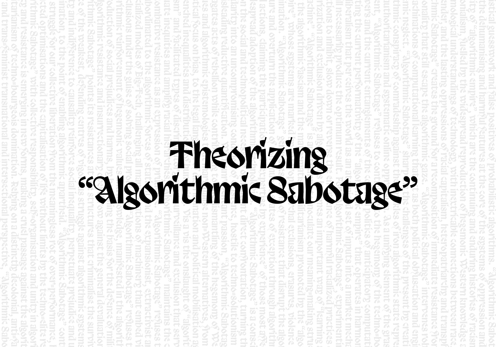



<div class="caption">Graphic: © Algorithmic Sabotage Research Group<span style="color:grey"> | The typeface used is Trickster from Velvetyne Foundry: https://velvetyne.fr/fonts/trickster/</span></div>

## Context

_“To criticize and deconstruct complex artifacts such as AI monopolies, first we should engage in the meticulous work of deconnectionism, undoing—step by step, file by file, dataset by dataset, piece of metadata by piece of metadata, correlation by correlation, pattern by pattern—the social and economic fabric that constitutes them in origin[^1].”_

Theorizing “Algorithmic Sabotage” represents an initial collective attempt to conceptualize the critical notion of “algorithmic sabotage” as a means of consciously working on artistic-activist and prefigurative techno-political strategies and aesthetics against the necropolitical technologies that reinforce structural injustices, algorithmic authoritarianism and the harmfulness of unrestrained technosolutionism.

The following document has been produced through a process of collective authorship. A copy of the entire text is available for consultation on a [Riseup Pad](https://pad.riseup.net/) (a browser-based collaborative text editor that enables the online creation and editing of documents based on [Etherpad](https://etherpad.org/)), via the following link: https://pad.riseup.net/p/tkuH3DkO3zCUR2WXICJX-keep. Readers are encouraged to contribute freely to the content.

<span style="color:grey">* Please be advised that this page is currently the subject of active research and will be updated in a timely manner as new information emerges regarding the collective authorship of the text. Furthermore, during the initial three-month period of 2025, the Algorithmic Sabotage Research Group (ASRG) will proceed with the production and distribution of a paper-based publication in a brochure format, which will present the collective authoring results. Designers interested in contributing to the design and layout of the brochure are invited to [contact](#contact) us at the information provided below.</span>

***

The following section presents a selection of extracts from the aforementioned document.

- _“Algorithmic Sabotage”_ articulates a collective approach to challenging the ideology of _“algorithms everywhere”_, in particular by shifting the focus from statistical inference to mutual care.

- _“Algorithmic Sabotage”_ supports freedom from the colonisation of everyday life by the cultural codes of patriarchy, racism or authoritarianism by refusing any participation in oppressive patterns of interaction.

- _“Algorithmic Sabotage”_ is the starting point for a radical, feminist and decolonial political praxis that seeks to militantly transcend the deep-seated necropolitical tendencies, predictive interventions, thoughtless optimisations, increasing flows of fascist affordances and the violence of solutionism that AI represents and implements in every aspect of social infrastructure, confirming the dystopian potentials of machine intelligence.

- _“Algorithmic Sabotage”_ signals a fundamental computational shift towards a techno-politics of refusal in a decolonial politics of algorithms and atmospheres, against the calculative dynamics of predictions, judgments by statistical guesswork and false positives of probabilistic algorithms.

- _“Algorithmic Sabotage”_ resists the dehumanising and harmful features at the core of the systems of oppression and axes of identity of _“algorithmic empire”_, which are the continuing and enduring histories of racism and colonialism, fuelled by the widespread reproduction of hegemonic Western knowledge and epistemological understandings of technology, with inextricable connections between race, class, and gender, and the lasting oppressions of racial capitalism, heteropatriarchy and transphobia.

- _“Algorithmic Sabotage”_ creates the ground for a recomposition of immediate resistance from forms of relationality that still escape the algorithmic gaze.

- _“Algorithmic Sabotage”_ intervenes robustly in the machinations of computational learning that act as both political obfuscation and engines of systemic neglect.

- _“Algorithmic Sabotage”_ sharpens the challenges of the present by creating an algorithmic conspiracy of comradeship against the shackles of iron algorithmic state repression, digital authoritarianism and systematic online oppression.

- As a unifying element of the grassroots movement, _“Algorithmic Sabotage”_ refuses to contribute to the hegemony of the techno-bourgeois powers and the current entanglements of the colonial politics of anticipatory computation, subverting the current performativity of the _“algorithmic empire”_ that operates in harmony with a neoliberalism that per ceives the world as an atomised set of inputs into a market mechanism that will necessarily produce the optimum result.

- For _“Algorithmic Sabotage”_, experimenting with actions to inhibit, slow down or reverse the emergence of harmful racialized practices of exteriorization and exclusion driven by algorithms becomes an important way of _“learning against the machine”_.

- _“Algorithmic Sabotage”_ is an attempt to inoculate our meaning-making structures against the algorithmic fascism and the mathematised utilitarianism promoted by the _“algorithmic empire”_, whose systems are marked by heteropatriarchal exclusions, erasures, violence and discrimination.

- _“Algorithmic Sabotage”_ generates forms of resistance that disrupt the algorithmic enclosure and overturn the application of continuous states of exception through algorithmically derived actions, claiming the participation and _“expertise by experience”_ of those most affected by the widespread adoption of the algorithmic technologies.

- _“Algorithmic Sabotage”_ is a conscious act based on the social and technopolitical necessity of militant direct confrontation, turning the word solidarity into an uncompromising condition of existence, hostile to techno-solutionism and misleading reductive quantification.

- With unrepentant passion, _“Algorithmic Sabotage”_ contributes to the dismantling of the hegemony of Western values and algorithmic epistemologies that marginalise non-Western alternatives, from the statistical focus on bias, to the legal language of discrimination and political mobilisation against entrenched inequalities and distributions of humanity.

- Vis a vis the onslaught of _“algorithmic racism”_ and facilitated types of discriminatory over-surveillance and exclusion that serve to perpetuate inequities and amplify racial hierarchies, _“Algorithmic Sabotage”_ maintains the capacity for combative resistance as an expression of prudence.

- _“Algorithmic Sabotage”_ refuses to be subordinated to the algorithmic forces of statism and the expansionist, extractivist and financialized modes of Big-Tech, challenging all manifestations of machinery that embed violent exclusions under the guise of solving social problems.

- _“Algorithmic Sabotage”_ points its resistances at the structures that criminalise the survival and existence of the weakest, defending centres of vigorous struggle against algorithmic systems whose opacity and indifference to causality reinforce social inequality, perpetuate prejudice and unjust discrimination, to the point of enabling algorithmic apartheid.

- _“Algorithmic Sabotage”_ contributes to the struggle for our collective liberation from the meaningless rot of over-performance, hyper-abstracted optimisations and the capitalisation of life without limits by the techno-elite regimes.

- _“Algorithmic Sabotage”_ with collective responsibility, self-organisation and unity in algorithmic agency and resistance is emerging in new forms, making a cruel passage against the algorithmic totalitarianism of techno-bourgeois domination.

- Relying on a distinctly decolonial, anti-fascist, queer and trans-feminist transnational and intersectional perspective, _“Algorithmic Sabotage”_ charts ways of resistance and refusal, organizing social territories of algorithmic agency and radical solidarity co-ordinations for sparking the outbreak of insurrections against sites of _“algorithmic coloniality”_.

- The struggle is everywhere across the algorithmic factory. _“Algorithmic Sabotage”_ chooses the social tactic of transversal solidarity to stand against social hierarchy and its algorithmic naturalisation.

- _“Algorithmic Sabotage”_ transforms algorithmic relations and deconstructs complex artefacts such as AI monopolies through the lens of a radical anti-fascist and decolonial approach, for a meticulous work of deconnectionism and undoing the imposition of standards of mechanical intelligence that propagate, more or less invisibly, social hierarchies of knowledge and skill.

- _“Algorithmic Sabotage”_ applies a critical vigilance to the political resonances of AI and acts as a trigger for mobilisation and counter-attack against the epistemic violence of computed abstractions, the correlation with implacable mathematical determination and the administrative violence of automated decisions.

- _“Algorithmic Sabotage”_ is explicitly configured as a political intervention, reclaiming and repositioning technical practice as one potential sphere of activist intervention.

- _“Algorithmic Sabotage”_ demonstrates that in a world administered by algorithms, it does matter what the algorithms can do.

- _“Algorithmic Sabotage”_ recognises the importance of situating forms of agency and direct resistance within the biased structures of domination and oppression that constitute the platform society.

- In everyday life, alliances with algorithms and rebellions against or through them alternate incessantly. _“Algorithmic Sabotage”_ exploits this continuous realignment of algorithmic alliances, giving life to contingent reconfigurations of power balances, recognizing algorithmic systems as socio-cultural and political battlegrounds where power is continuously renegotiated.

- _“Algorithmic Sabotage”_ draws on a long historical pedigree of political struggle against injustice, authoritarianism and top-down technological transformation, recovering tactical lessons and a sense of militancy committed to the common good from the time of the Luddites.

- _“Algorithmic Sabotage”_ is the response needed to tactically and strategically tackle the challenges posed by algorithmic power, whose invisible ubiquity, fake accuracy and simulated objectivity, they orchestrate a chilling symphony of oppression, with marginalised communities worldwide bearing the brunt of the automated violence.

- _“Algorithmic Sabotage”_ resists the _“structural forms of domination”_ and the use of imperial power of the digital colonialism of the _“technology empires”_ that hold the dominant positions through their total control of digital infrastructures, data and the ownership of computational power.

- _“Algorithmic Sabotage”_ seeks to evoke hope based on the knowledge that ordinary people have always opposed rampant injustices and cruelties, and draws on those long histories of resistance.

- _“Algorithmic Sabotage”_ highlights the entanglement of the algorithmic harmfulness of _“algorithmic empire”_ with ongoing forms of societal disintegration, from austerity to far-right politics, and from racialized algorithmic violence to the production of states of exception.

- _“Algorithmic Sabotage”_ encourages the existence of informal direct action cells that fuel the outbreak of counter-violence against elaborate statistical guesswork and algorithmic authoritarianism.

- _“Algorithmic Sabotage”_ systematically explores how the essentialising nature of _“algorithmic empire”_ systems fuels social divisions and, in its most extreme forms, the violent ultra-nationalist politics of our time.

- While unfettered AI functions as a new means of enclosure, algorithmically intensifying precarity, authoritarianism and necropolitics, _“Algorithmic Sabotage”_ draws on the experiences of those on the margins and resists these encroachments by attempting to overturn them.

- _“Algorithmic Sabotage”_ responds to in ways that reverse the dynamics of _“algorithmic empire”_, which as a socio-technical system leads to the transformation of economic and social structures in ways that concentrate power and marginalise people.

- _“Algorithmic Sabotage”_ contributes to foregrounding algorithmic agency and resistance not as episodic, but as ingrained into the very fabric of our everyday experiences.

- _“Algorithmic Sabotage”_ gains traction by starting from existing points of struggle at the margins, recognising the politically reactionary consequences of AI and other computational technologies whose statistical logics reveal continuities with racism, colonial relations and white supremacy.

- _“Algorithmic Sabotage”_ combines and transforms art, activism and resistance into a political struggle capable of taking direct action on behalf of the community to highlight, critique, disrupt and counter the encroachments of contemporary technologies that always looking for and multiply differences and are haunted by a racist-colonialist and classist past, not only regarding its functioning.

- Rather than catastrophist imaginaries of the future, _“Algorithmic Sabotage”_ aims to develop organisational counter-power to resist the wider outcomes of AI-scaling callousness, collateral damage and the aggressive abstractions that drive the algorithms on the most vulnerable and marginalised identities.

- Drawing on initiative, political freedom, equality and collective development to underpin a counter-politics of _“algorithmic empire”_, _“Algorithmic Sabotage”_ examines key aspects of Luddite resistance and their contemporary relevance, for a radical response to the atmosphere of algorithmic paranoia to which machine learning is already contributing, through the prospect of pervasive algorithmic prediction across fields of social interaction.

- _“Algorithmic Sabotage”_ integrates tactics of obfuscation and disengagement as a form of vernacular resistance to the surveillance regimes of digital platforms.

- _“Algorithmic Sabotage”_ urges a new literacy that recognises the need for a complex and socially grounded response to the mathematico-cultural force whose predictive and inferential operations generate both unreliable knowledge and epistemic injustice.

- A new counter-culture is developing against the knowledge regime imposed by the _“algorithmic empire”_, the net effect of which is to accelerate precarisation, outsourcing and privatisation under the cover of over-hyped technology. _“Algorithmic Sabotage”_ is a precocious sign of this new movement.

- _“Algorithmic Sabotage”_ transforms mathematised immiseration into a creative and autonomous relationship of reciprocity, forging through struggle a new kind of hammer to disrupt and overturn the array of violence reinforced by the _“algorithmic empire”_ in epistemic, administrative and structural forms, enabling a continuous exodus from computational relations of exploitation.

- Solidarity is the inversion of the algorithmic states of exception. The _“Algorithmic Sabotage”_ draws on the politics of mutual aid and algorithmic solidarity to articulate an alternative that indicates all those forms of cooperation and mutual support that are emerging to face the power of the algorithms.

- In contrast to the repressions magnified by _“algorithmic empire”_, which flow from the resonances between hegemonic politics and technical methodologies, _“Algorithmic Sabotage”_ operates as one of the formations of an alternative socially transformative potential that counteracts advanced technologies like AI that lead to a new dystopia dominated by the intensification of existing misery through speculative tendencies that echo those of finance capital.

- The aim of _“Algorithmic Sabotage”_ is not simply to overcome reductionist assumptions, the algorithmic extension of carelessness, calculative rationing and the optimised extensions of precarity and scarcity, but to act politically against the amplification of epistemic injustice.

- _“Algorithmic Sabotage”_ is the line of flight from a technological capture, a means of countering the causeless effect of machinic classifications, algorithmic bureaucracies and the multiple moments of administrative violence, especially among the most vulnerable and least visible.

- Through a politics of militant care and a commitment to boundless solidarity, ethics and fairness, _“Algorithmic Sabotage”_ challenges the opacity of parallel computation with open argument, and the environmentality of algorithms with wildcat direct action.

- Reflected as an activity that crosses practices and languages, _“Algorithmic Sabotage”_ promotes a decolonial ethos that encourages genuine forms of _“contact”_ that are not based on violence and subjugation, but instead generate _“solidarities across class, race and national boundaries”_, equipping us to confront an Anthropocene epoch in which _“humanity”_ and digital colonial power are increasingly conflated.

## Supplemental Information

Please find below a preliminary reading list, which will be updated on a regular basis.

{}

- Crawford, K. and Paglen, T. (2019) Excavating AI: The Politics of Images in Machine Learning Training Sets, excavating.ai. Available at: https://excavating.ai/.

- Ekbia, H. and Nardi, B. (2017) Heteromation, and other stories of computing and capitalism. The MIT Press.

- Gebru, T., & Torres, Émile P. (2024). The TESCREAL bundle: Eugenics and the promise of utopia through artificial general intelligence. First Monday, 29(4). https://doi.org/10.5210/fm.v29i4.13636

- Mcquillan, D. (2015) Data Luddism, danmcquillan.org. Available at: https://danmcquillan.org/dataluddism.html.

- McQuillan, D. (2018) People’s Councils for Ethical Machine Learning. Available at: https://journals.sagepub.com/doi/full/10.1177/2056305118768303.

- McQuillan, D. 2021. Post-Humanism, Mutual Aid. In: Verdegem, P. (ed.) AI for Everyone? Critical Perspectives. Pp. 67–83. London: University of Westminster Press. DOI: https://doi.org/10.16997/book55.e. License: CC-BY-NC-ND 4.0

- McQuillan, D. (2022). Resisting AI. Available at: https://doi.org/10.51952/9781529213522.

- Pasquinelli, M. (2023) The Automation of General Intelligence, Journal #141. Available at: https://www.e-flux.com/journal/141/577253/the-automation-of-general-intelligence/.

- Pasquinelli, M. and Joler, V. (2021) The nooscope manifested: AI as instrument of knowledge extractivism, AI & society. Available at: https://www.ncbi.nlm.nih.gov/pmc/articles/PMC7680082/.
 
- Tacheva, J., & Ramasubramanian, S. (2023). AI Empire: Unraveling the interlocking systems of oppression in generative AI’s global order. Big Data & Society, 10(2). Available at: https://journals.sagepub.com/doi/10.1177/20539517231219241.
 
- Woodcock, J. (2021) Towards a digital workerism: Workers’ inquiry, methods, and Technologies - NanoEthics, SpringerLink. Available at: https://link.springer.com/article/10.1007/s11569-021-00384-w.

{}

### Contact {#contact}

Should you wish to provide comments or suggestions regarding this text, we kindly request that you direct them to our email address, which is: `x7kekmg7@proton.me`.

To ensure secure email communication, we request that you use our GPG key in conjunction with the aforementioned email address. You can obtain the relevant public key either from [here](https://algorithmic-sabotage.github.io/asrg/about/DD4FF0D691C7C8F501C1CD0441CC385A75C16CD7.asc) or from a public key server by entering the following command:

```
gpg --recv-keys DD4FF0D691C7C8F501C1CD0441CC385A75C16CD7
```

### Credits

#### Image

Front Page Image: A crowd in San Francisco’s Chinatown surrounded a Waymo robotaxi on Saturday, breaking windows and throwing fireworks inside, setting the vehicle ablaze. Source: https://content.sfstandard.com/wp-content/uploads/2024/02/waymo-on-fire-03.jpg?w=1920&q=75.

[^1]: Pasquinelli, M. (2023) The Automation of General Intelligence, Journal #141. Available at: https://www.e-flux.com/journal/141/577253/the-automation-of-general-intelligence/.
