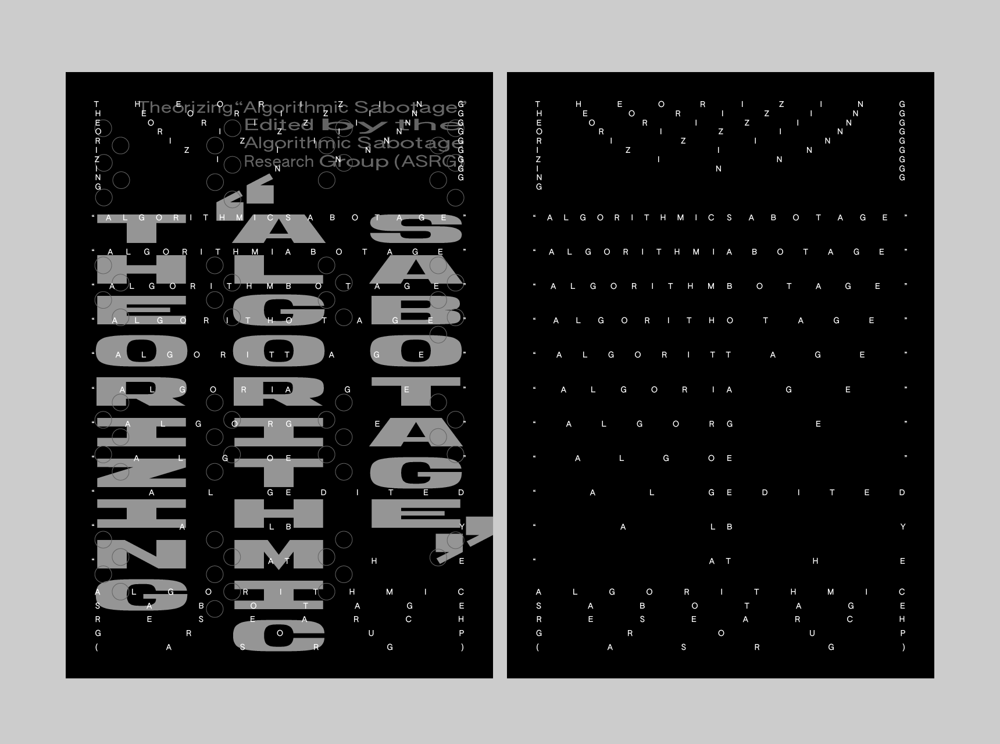



<div class="caption">An image illustrating the front and back covers of the e-brochure <em>Theorizing “Algorithmic Sabotage”</em>. The design and layout were developed by <a href="https://www.apsara.ch/">Apsara Flury</a>.</div>

## Context

_“To criticize and deconstruct complex artifacts such as AI monopolies, first we should engage in the meticulous work of deconnectionism, undoing—step by step, file by file, dataset by dataset, piece of metadata by piece of metadata, correlation by correlation, pattern by pattern—the social and economic fabric that constitutes them in origin[^1].”_

The text, entitled _Theorizing “Algorithmic Sabotage,”_ constitutes the introductory section of a collaborative, multi-authored endeavor dedicated to the theoretical exploration of the critical concept of _“algorithmic sabotage.”_ It seeks to articulate a comprehensive analytical framework for its conceptualization and the examination of its diverse operationalizations, positioning it as a form of prefigurative praxis that directly disrupts the threat while simultaneously defending spaces outside of algorithmic capture. This analytical approach is delineated through a series of discrete theoretical propositions, collectively developed via a multi-stage, open authorship process. The resultant propositions elucidate the underlying principles, strategic approaches, and aesthetic manifestations of the critical notion of _“algorithmic sabotage”_ within the broader framework of digital culture and information technology. _Theorizing “Algorithmic Sabotage”_ represents a central component of the ongoing research initiative of the Algorithmic Sabotage Research Group (ASRG).

### Statements

The following section presents a representative sample of discrete propositions generated through a dynamic, open, and collaborative writing process, shaped by the substantial contributions of a diverse group of authors. Readers are invited to actively engage in the ongoing development of the content, with the understanding that their contributions will be evaluated and integrated as deemed appropriate.

An ongoing, editable version of the text titled _Theorizing “Algorithmic Sabotage”_ is available on a [Riseup Pad](https://pad.riseup.net/)—a browser-based collaborative text editor that enables the online creation and editing of documents based on [Etherpad](https://etherpad.org/). The text can be accessed via the following link: https://pad.riseup.net/p/tkuH3DkO3zCUR2WXICJX-keep.

{}

- _“Algorithmic Sabotage”_ articulates a collective approach to challenging the ideology of _“algorithms everywhere”_, in particular by shifting the focus from statistical inference to mutual care.

- _“Algorithmic Sabotage”_ supports freedom from the colonisation of everyday life by the cultural codes of patriarchy, racism or authoritarianism by refusing any participation in oppressive patterns of interaction.

- _“Algorithmic Sabotage”_ is the starting point for a radical, feminist and decolonial political praxis that seeks to militantly transcend the deep-seated necropolitical tendencies, predictive interventions, thoughtless optimisations, increasing flows of fascist affordances and the violence of solutionism that AI represents and implements in every aspect of social infrastructure, confirming the dystopian potentials of machine intelligence.

- _“Algorithmic Sabotage”_ signals a fundamental computational shift towards a prefigurative techno-political approach of refusal within a decolonial politics of algorithms and atmospheres, against the calculative dynamics of predictions, judgments by statistical guesswork and false positives of probabilistic algorithms.

- _“Algorithmic Sabotage”_ resists the dehumanising and harmful features at the core of the systems of oppression and axes of identity of _“algorithmic empire”_, which are the continuing and enduring histories of racism and colonialism, fuelled by the widespread reproduction of hegemonic Western knowledge and epistemological understandings of technology, with inextricable connections between race, class, and gender, and the lasting oppressions of racial capitalism, heteropatriarchy and transphobia.

- _“Algorithmic Sabotage”_ creates the ground for a recomposition of immediate resistance from forms of relationality that still escape the algorithmic gaze.

- _“Algorithmic Sabotage”_ intervenes robustly in the machinations of computational learning that act as both political obfuscation and engines of systemic neglect.

- _“Algorithmic Sabotage”_ sharpens the challenges of the present by creating an algorithmic conspiracy of comradeship against the shackles of iron algorithmic state repression, digital authoritarianism and systematic online oppression.

- _“Algorithmic Sabotage”_ challenges technological developments in AI, which, like the eugenic techniques of the pre-digital era, use statistical methods to rationalise and individualise problems of social origin.

- _“Algorithmic Sabotage”_ situates care at the centre of both research and action, aiming to counter the operationalizations of AI that can be understood as a machinic instantiation of a technocratic, institutional, and top-down worldview.

- As a unifying element of the grassroots movement, _“Algorithmic Sabotage”_ refuses to contribute to the hegemony of the techno-bourgeois powers and the current entanglements of the colonial politics of anticipatory computation, subverting the current performativity of the _“algorithmic empire”_ that operates in harmony with a neoliberalism that per ceives the world as an atomised set of inputs into a market mechanism that will necessarily produce the optimum result.

- For _“Algorithmic Sabotage”_, experimenting with actions to inhibit, slow down or reverse the emergence of harmful racialized practices of exteriorization and exclusion driven by algorithms becomes an important way of _“learning against the machine”_.

- _“Algorithmic Sabotage”_ points towards the role of AI’s supply chain in the perpetuation of environmental degradation with human and ecological impacts on climate justice.

- _“Algorithmic Sabotage”_ is an attempt to inoculate our meaning-making structures against the algorithmic fascism and the mathematised utilitarianism promoted by the _“algorithmic empire”_, whose systems are marked by heteropatriarchal exclusions, erasures, violence and discrimination.

- _“Algorithmic Sabotage”_ unravels the interlocking systems of oppression in the global order of generative AI in order to overturn the hierarchies of power and extraction that shape its contemporary development.

- _“Algorithmic Sabotage”_ is a conscious act based on the social and technopolitical necessity of militant direct confrontation, turning the word solidarity into an uncompromising condition of existence hostile to the harmfulness of unrestrained techno-solutionism, machinic eugenics, and misleading reductive quantification.

- Vis a vis the onslaught of _“algorithmic racism”_ and facilitated types of discriminatory over-surveillance and exclusion that serve to perpetuate inequities and amplify racial hierarchies, _“Algorithmic Sabotage”_ maintains the capacity for combative resistance as an expression of prudence.

- _“Algorithmic Sabotage”_ refuses to be subordinated to the algorithmic forces of statism and the expansionist, extractivist and financialized modes of Big-Tech, challenging all manifestations of machinery that embed violent exclusions under the guise of solving social problems.

- _“Algorithmic Sabotage”_ points its resistances at the structures that criminalise the survival and existence of the weakest, defending centres of vigorous struggle against algorithmic systems whose opacity and indifference to causality reinforce social inequality, perpetuate prejudice and unjust discrimination, to the point of enabling algorithmic apartheid.

- _“Algorithmic Sabotage”_ contributes to the ongoing struggle for collective liberation from the pervasive and oppressive forces of hyper-abstracted optimisations, the meaningless rot of over-performance, and the capitalisation of life without limits, by techno-elite regimes.

- _“Algorithmic Sabotage”_ resists the use and expansion of carceral AI, which often reinforces or masks existing structural injustices and extends the reach of carceral systems under the guise of scientific rigour. Carceral AI is only one part of a complex of technologies fueled by long-standing geopolitical agendas of control, conquest and exclusion.

- _“Algorithmic Sabotage”_ represents a corrective to the aggressive abstraction of AI and its contemporary culture, which is pervaded by misogynistic and socially reactionary rhetoric.

- _“Algorithmic Sabotage”_ is an urgent demand to seize the means of computation, not only to address the immediate challenges we face, but also to engage in the long-term struggles necessary to thwart and overturn techno-feudal domination, bringing into focus more clearly than ever the revolution we need to escape our techno-authoritarian prison.

- Relying on a distinctly decolonial, anti-fascist, queer and trans-feminist transnational and intersectional perspective, _“Algorithmic Sabotage”_ charts ways of resistance and refusal, organizing social territories of algorithmic agency and radical solidarity co-ordinations for sparking the outbreak of insurrections against sites of _“algorithmic coloniality”_.

- The struggle is everywhere across the algorithmic factory. _“Algorithmic Sabotage”_ chooses the social tactic of transversal solidarity to stand against social hierarchy and its algorithmic naturalisation.

- _“Algorithmic Sabotage”_ transforms algorithmic relations and deconstructs complex artefacts such as AI monopolies through the lens of a radical anti-fascist and decolonial approach, for a meticulous work of deconnectionism and undoing the imposition of standards of mechanical intelligence that propagate, more or less invisibly, social hierarchies of knowledge and skill.

- _“Algorithmic Sabotage”_ applies a critical vigilance to the political resonances of AI, acting as a trigger for mobilisation and counter-attack against the epistemic violence of computed abstractions, the correlation with implacable mathematical determination, and the administrative violence of automated decisions.

- _“Algorithmic Sabotage”_ is explicitly configured as a political intervention, reclaiming and repositioning technical practice as one potential sphere of activist intervention.

- _“Algorithmic Sabotage”_ demonstrates that in a world administered by algorithms, it does matter what the algorithms can do.

- _“Algorithmic Sabotage”_ recognises the importance of situating forms of agency and direct resistance within the biased structures of domination and oppression that constitute the platform society.

- In everyday life, alliances with algorithms and rebellions against or through them alternate incessantly. _“Algorithmic Sabotage”_ exploits this continuous realignment of algorithmic alliances, giving life to contingent reconfigurations of power balances, recognizing algorithmic systems as socio-cultural and political battlegrounds where power is continuously renegotiated.

- _“Algorithmic Sabotage”_ draws on a long historical pedigree of political struggle against injustice, authoritarianism and top-down technological transformation, recovering tactical lessons and a sense of militancy committed to the common good from the time of the Luddites.

- _“Algorithmic Sabotage”_ is the response needed to tactically and strategically tackle the challenges posed by algorithmic power, whose invisible ubiquity, fake accuracy and simulated objectivity orchestrate a chilling symphony of oppression, with marginalized communities worldwide bearing the brunt of the automated violence.

- _“Algorithmic Sabotage”_ acts as a brake on the class, gender and racial biases that AI systems reinforce, considering them not just as a technical flaws, but as an inherently discriminatory feature of automation in a capitalist context.

- _“Algorithmic Sabotage”_ seeks to evoke hope based on the knowledge that ordinary people have always opposed rampant injustices and cruelties, and draws on those long histories of resistance.

- _“Algorithmic Sabotage”_ operationalises beyond the miasma of AI hype, disrupting the grand capitalist project that pursues labor automation alongside the imposition of hierarchies and disciplinary mechanisms that preserve, expand, or re-legitimize forms of social control.

- _“Algorithmic Sabotage”_ highlights the entanglement of the algorithmic harmfulness of _“algorithmic empire”_ with ongoing forms of societal disintegration, from austerity to far-right politics, and from racialized algorithmic violence to the production of states of exception.

- _“Algorithmic Sabotage”_ encourages the existence of informal direct action cells that fuel the outbreak of counter-violence against elaborate statistical guesswork and algorithmic authoritarianism.

- _“Algorithmic Sabotage”_ systematically explores how the essentialising nature of _“algorithmic empire”_ fuels social divisions and, in its most extreme forms, the violent ultra-nationalist politics of our time.

- While unfettered AI functions as a new means of enclosure, algorithmically intensifying precarity, authoritarianism and necropolitics, _“Algorithmic Sabotage”_ draws on the experiences of those on the margins and resists these encroachments by attempting to overturn them.

- _“Algorithmic Sabotage”_ seeks to clog the plurality of extractive dynamics in AI production that reinforce global power asymmetries.

- _“Algorithmic Sabotage”_ responds to in ways that reverse the dynamics of _“algorithmic empire”_, which as a socio-technical system leads to the transformation of economic and social structures in ways that concentrate power and marginalise people.

- _“Algorithmic Sabotage”_ contributes to foregrounding algorithmic agency and resistance not as episodic, but as ingrained into the very fabric of our everyday experiences.

- _“Algorithmic Sabotage”_ gains traction by starting from existing points of struggle at the margins, recognising the politically reactionary consequences of AI and other computational technologies whose statistical logics reveal continuities with racism, colonial relations and white supremacy.

- _“Algorithmic Sabotage”_ combines and transforms art, activism and resistance into a political struggle capable of taking direct action on behalf of the community to highlight, critique, disrupt and counter the encroachments of contemporary technologies that always looking for and multiply differences and are haunted by a racist-colonialist and classist past, not only regarding its functioning.

- _“Algorithmic Sabotage”_ is a rationale for more collective action, an approach that starts from the interconnectedness of the technical, environmental and social, and attempts to iterate towards a computing that is consistent with social justice and environmental sustainability.

- Drawing on initiative, political freedom, equality and collective development to underpin a counter-politics of _“algorithmic empire”_, _“Algorithmic Sabotage”_ examines key aspects of Luddite resistance and their contemporary relevance, for a radical response to the atmosphere of algorithmic paranoia to which machine learning is already contributing, through the prospect of pervasive algorithmic prediction across fields of social interaction.

- _“Algorithmic Sabotage”_ integrates tactics of obfuscation and disengagement as a form of vernacular resistance to the surveillance regimes of digital platforms.

- _“Algorithmic Sabotage”_ urges a new literacy that recognises the need for a complex and socially grounded response to the mathematico-cultural force whose predictive and inferential operations generate both unreliable knowledge and epistemic injustice.

- A new counter-culture is developing against the knowledge regime imposed by the _“algorithmic empire”_, the net effect of which is to accelerate precarisation, outsourcing and privatisation under the cover of over-hyped technology. _“Algorithmic Sabotage”_ is a precocious sign of this new movement.

- _“Algorithmic Sabotage”_ transforms mathematised immiseration into a creative and autonomous relationship of reciprocity, forging through struggle a new kind of hammer to disrupt and overturn the array of violence reinforced by the _“algorithmic empire”_ in epistemic, administrative and structural forms.

- _“Algorithmic Sabotage”_ examines the technical aspects of machine learning systems, including data collection, model training and algorithmic outputs, to reveal the link between racist ideologies and the grounded harms of modern computation.

- Solidarity is the inversion of the algorithmic states of exception. The _“Algorithmic Sabotage”_ draws on the politics of mutual aid and algorithmic solidarity to articulate an alternative that indicates all those forms of cooperation and mutual support that are emerging to face the power of the algorithms.

- In contrast to the repressions magnified by the _“algorithmic empire”_, which flow from the resonances between hegemonic politics and technical methodologies, _“Algorithmic Sabotage”_ operates as one of the formations of an alternative socially transformative potential that counteracts advanced technologies like AI that lead to a new dystopia dominated by the intensification of existing misery through speculative tendencies that echo those of finance capital.

- The aim of _“Algorithmic Sabotage”_ is not simply to overcome reductionist assumptions, the algorithmic extension of carelessness, calculative rationing and the optimised extensions of precarity and scarcity, but to act politically against the amplification of epistemic injustice.

- _“Algorithmic Sabotage”_ is the line of flight from a technological capture, a means of countering the causeless effect of machinic classifications, algorithmic bureaucracies and the multiple moments of administrative violence, especially among the most vulnerable and least visible.

- Through a politics of militant care and a commitment to boundless solidarity, ethics and fairness, _“Algorithmic Sabotage”_ challenges the opacity of parallel computation with open argument, and the environmentality of algorithms with wildcat direct action.

- As necropolitical power is materialised in current forms of advanced computation, _“Algorithmic Sabotage”_ represents a radical reworking of our technopolitical arrangements, shifting the focus from the nihilism of neural networks and towards the development of adaptive and open-ended systems.

- _“Algorithmic Sabotage”_ assimilates an abstract and potentially alienating mathematical-computational method in order to militantly oppose to any fascist logic that _“automates inequality”_ and applies data-driven disproportionate burdens and violence to the most vulnerable demographics.

- _“Algorithmic Sabotage”_ is constantly re-emerging as a response to the vicissitudes of neoliberal fragmentation, including situations where the exploitation is powered by algorithmic systems.

{}

<span style="color:grey">* Kindly note that the project, _Theorizing “Algorithmic Sabotage,”_ is presently undergoing active research. Updates will be disseminated in due course as new findings and developments emerge.</span>

## Supplemental Information

### Preliminary Reading

Please refer to the preliminary reading list provided below, which has served as a foundational reference for the co-authoring process. It is important to emphasize that this list, which will be periodically revised, is not exhaustive and is intended primarily as an initial framework to guide further research and exploration.

{}

- Crawford, K. and Paglen, T. (2019) Excavating AI: The Politics of Images in Machine Learning Training Sets, excavating.ai. Available at: https://excavating.ai/.

- Ekbia, H. and Nardi, B. (2017) Heteromation, and other stories of computing and capitalism. The MIT Press.

- Fricker, Miranda (2007): Epistemic Injustice: Power and the Ethics of Knowing. Oxford, New York: Oxford University Press.

- Mbembe, A., & Corcoran, S. (2019). Necropolitics. Duke University.

- McQuillan, D. (2015). Algorithmic states of exception. European Journal of Cultural Studies, 18(4-5), 564-576. Available at: https://doi.org/10.1177/1367549415577389.

- McQuillan, D. (2018). People’s Councils for Ethical Machine Learning. Social Media + Society, 4(2). Available at: https://doi.org/10.1177/2056305118768303.

- McQuillan, D. (2022). Resisting AI. Bristol, UK: Bristol University Press. Available at: https://doi.org/10.51952/9781529213522.

- Muldoon, J., Wu, B.A. Artificial Intelligence in the Colonial Matrix of Power. Philos. Technol. 36, 80 (2023). Available at: https://doi.org/10.1007/s13347-023-00687-8.

- Pasquinelli, M. (2023) The Automation of General Intelligence, Journal #141. Available at: https://www.e-flux.com/journal/141/577253/the-automation-of-general-intelligence/.

- Pasquinelli, M. and Joler, V. (2021) The nooscope manifested: AI as instrument of knowledge extractivism, AI & society. Available at: https://www.ncbi.nlm.nih.gov/pmc/articles/PMC7680082/.

- Spade, D. (2015) Normal Life: Administrative Violence, Critical Trans Politics, and the Limits of Law. Durham, NC; London, UK: Duke University Press.

- Tacheva, J., & Ramasubramanian, S. (2023). AI Empire: Unraveling the interlocking systems of oppression in generative AI’s global order. Big Data & Society, 10(2). Available at: https://journals.sagepub.com/doi/10.1177/20539517231219241.

- Woodcock, J. Towards a Digital Workerism: Workers’ Inquiry, Methods, and Technologies. Nanoethics 15, 87–98 (2021). Available at: https://doi.org/10.1007/s11569-021-00384-w.

{}

### Download

#### E-Brochure

The initial version of the text is available for download as an e-brochure in [PDF](files/e-brochure-theorizing-algorithmic_sabotage-a5.pdf) format. Entitled _Theorizing “Algorithmic Sabotage”_, this brochure has been edited by the Algorithmic Sabotage Research Group (ASRG). The design and layout were created by [Apsara Flury](https://www.apsara.ch/) and produced using the [Alternative Layout System](https://alternativelayoutsystem.com/), a framework developed by Giliane Cachin and INT Studio. The publication incorporates the typefaces _Authentic Sans_ by [AUTHENTIC](https://authentic.website/) and _Generation Mono_ by [Nguyen Gobber](https://nguyengobber.com/typefaces/generation-mono). It is distributed under the terms of the _Collective Conditions for Re-Use (CC4r) 1.0_ license. For a comprehensive explanation of this licensing framework, please refer to the official documentation available at https://constantvzw.org/wefts/cc4r.en.html.

### Contact

If you wish to offer comments or suggestions pertaining to this text, we kindly invite you to send them to our designated email address: [x7kekmg7@proton.me](mailto:x7kekmg7@proton.me).

For secure email communication, we encourage the use of our GPG key in conjunction with the provided email address. The corresponding public key can be accessed either from [here](https://algorithmic-sabotage.github.io/asrg/about/DD4FF0D691C7C8F501C1CD0441CC385A75C16CD7.asc) or retrieved from a public key server by executing the following command:

```
gpg --recv-keys DD4FF0D691C7C8F501C1CD0441CC385A75C16CD7
```

### Credits

#### Image

Front Page Image: A crowd in San Francisco’s Chinatown surrounded a Waymo robotaxi on Saturday, breaking windows and throwing fireworks inside, setting the vehicle ablaze. Source: https://content.sfstandard.com/wp-content/uploads/2024/02/waymo-on-fire-03.jpg?w=1920&q=75.

[^1]: Pasquinelli, M. (2023) The Automation of General Intelligence, Journal #141. Available at: https://www.e-flux.com/journal/141/577253/the-automation-of-general-intelligence/.
