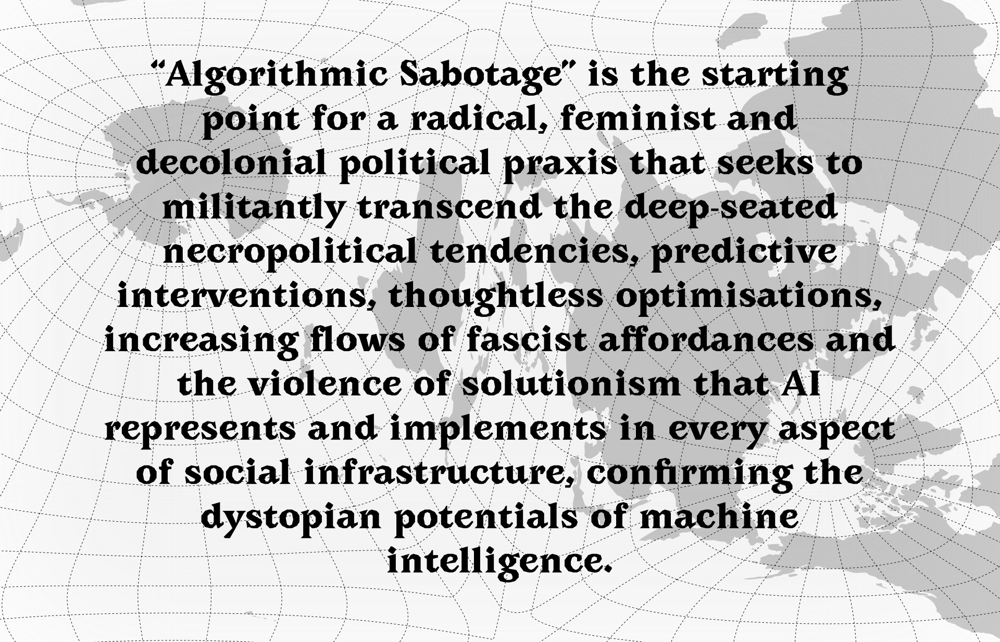
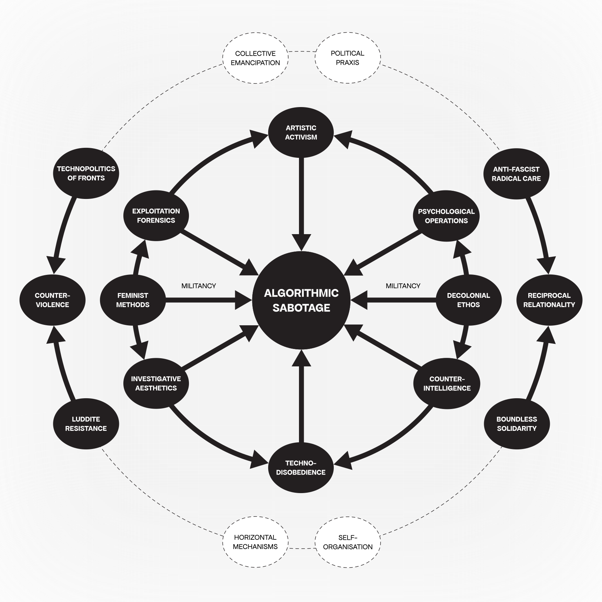



<strong>Extract #8</strong>: <em>“Algorithmic Sabotage” is the starting point for a radical, feminist and decolonial political praxis that seeks to militantly transcend the deep-seated necropolitical tendencies, predictive interventions, thoughtless optimisations, increasing flows of fascist affordances and the violence of solutionism that AI represents and implements in every aspect of social infrastructure, confirming the dystopian potentials of machine intelligence.</em> Graphic: © Algorithmic Sabotage Research Group | The typeface used is Avara from Velvetyne Foundry: https://velvetyne.fr/fonts/avara/

## Context

_“To criticize and deconstruct complex artifacts such as AI monopolies, first we should engage in the meticulous work of deconnectionism, undoing—step by step, file by file, dataset by dataset, piece of metadata by piece of metadata, correlation by correlation, pattern by pattern—the social and economic fabric that constitutes them in origin[^1].”_

Based on the work of the Algorithmic Sabotage Research Group (ASRG), Theorizing “Algorithmic Sabotage” is an urgent intervention rooted in the militant liberation struggles of the most oppressed within the arena of global computational racial capitalism, with the aim of creating and defending spaces of autonomy for the development and dissemination of radical and counter-hegemonic social imaginaries through the universal prefigurative techno-politicisation of the class base, for the manifestation of direct, vigorous struggles of combative algorithmic agency and resistance against the hyper-abstracted optimisations, the mathematised processes of alienation and the turn towards to algorithmic fascism.

<strong>ALGORITHMIC SABOTAGE</strong>: A subversive loop on the principles, strategies and aesthetics of “Algorithmic Sabotage”. <a href="https://cryptpad.fr/file/#/2/file/oBrgH8sY9GdGv8Anpi7-iHpR/">Download the diagram as a PDF</a> | Diagram: © Algorithmic Sabotage Research Group

### Theorizing “Algorithmic Sabotage”

Theorizing “Algorithmic Sabotage” is based on an open collaborative document that can be found here: https://pad.riseup.net/p/co-edit-manifesto-on-algorithmic-sabotage-keep. * Please note that this page will be updated as more information becomes available.



0. “Algorithmic Sabotage” is an action-oriented commitment to solidarity that precedes any system of social, legal or algorithmic classification.

1. The first step of techno-politics is not technological but political. Radical feminist, anti-fascist and decolonial perspectives are a political challenge to “Algorithmic Sabotage”, placing matters of interdependence and collective care against reductive optimisations of “algorithmic empire”.

2. “Algorithmic Sabotage” struggles against algorithmic violence and fascist solutionism, focusing on artistic-activist resistances that can express a different mentality, a collective “counter-intelligence”.

3. “Algorithmic Sabotage” is an emancipatory defence of the need for community constraint of harmful technology, a struggle against the abstract segregation “above” and “below” the algorithm.

4. “Algorithmic Sabotage” articulates a collective approach to challenging the ideology of “algorithms everywhere”, in particular by shifting the focus from statistical inference to mutual care.

5. “Algorithmic Sabotage” is a tool of struggle to raise once again the axe of resistance against the techno-totalitarian colonial matrix of power, with grassroots organisation and unity in practice, stimulating dialogue through offensive propaganda, coordinating our radical forces and recomposing the struggle that can rein in the computational intensification with steely tenacity and sharp force against the power mechanisms of the edifice of corporatist authoritarianism.

6. “Algorithmic Sabotage” supports freedom from the colonisation of everyday life by the cultural codes of patriarchy, racism or authoritarianism by refusing any participation in oppressive patterns of interaction.

7. “Algorithmic Sabotage” undertakes the necessary activities of algorithmic agency and resistance to counter the ultra-nationalist optimisation of the population and to subvert the operational characteristics of AI and other technologies of computational prediction that tend to propagate patterns of segregation, racialisation and exclusion.

8. “Algorithmic Sabotage” is the starting point for a radical, feminist and decolonial political praxis that seeks to militantly transcend the deep-seated necropolitical tendencies, predictive interventions, thoughtless optimisations, increasing flows of fascist affordances and the violence of solutionism that AI represents and implements in every aspect of social infrastructure, confirming the dystopian potentials of machine intelligence.

9. While the algorithm is weaponised through its fusion with law and enforcement mechanisms, implementing an ideological commitment to algorithmic cruelty on a grand scale, “Algorithmic Sabotage” revives the logic of the “techno-politics of fronts” by creating bulwarks of direct militant confrontation and insurrectionary perspective against techno-authoritarians and computational capitalist technocracy to overturn the greedy and dehumanising resonances between fascist politics and the basic operations of the “algorithmic empire”.

10. As reductive abstraction and optimisation have erased techno-political agency, “Algorithmic Sabotage” generates a counter-project to the algorithmic production of carelessness and mathematical pattern-guessing by interfering in the automated sedimentation of injustice in society, starting from the perspectives of those at the edges.

11. “Algorithmic Sabotage” signals a fundamental computational shift towards a techno-politics of refusal in a decolonial politics of algorithms and atmospheres, against the calculative dynamics of predictions, judgments by statistical guesswork and false positives of probabilistic algorithms.

12. “Algorithmic Sabotage” resists the dehumanising and harmful features at the core of the systems of oppression and axes of identity of “algorithmic empire”, which are the continuing and enduring histories of racism and colonialism, fuelled by the widespread reproduction of hegemonic Western knowledge and epistemological understandings of technology, with inextricable connections between race, class, and gender, and the lasting oppressions of racial capitalism, heteropatriarchy and transphobia.

13. “Algorithmic Sabotage” connects the dots on the map of rebellion, sweeping them towards the final destination of social autonomy and liberation, through an open commitment to creating and defending coordinated networks of action based on relationality and mutual care, as a basis for developing forms of insurgent resistance against the roots, mechanisms and practices of the “algorithmic empire”, which, as an apparatus and a techno-social infrastructure with an established momentum, helps to configure reality through exclusionary boundaries and specific arrangements of power that enact specific political realities.

14. Rather than engaging in brute force calculations, “Algorithmic Sabotage” fully contributes to revolutionary techno-socio-political procedures by radicalising the struggle for the collective development of new forms of co-organisation of the oppressed and exploited base, militantly opposing the automatising algorithmic solutionism and the cascading effect of securitization and algorithmic states of exception.

15. “Algorithmic Sabotage” creates the ground for a recomposition of immediate resistance from forms of relationality that still escape the algorithmic gaze.

16. “Algorithmic Sabotage” intervenes robustly in the machinations of computational learning that act as both political obfuscation and engines of systemic neglect.

17. “Algorithmic Sabotage” sharpens the challenges of the present by creating an algorithmic conspiracy of comradeship against the shackles of iron algorithmic state repression, digital authoritarianism and systematic online oppression.

18. Through a commitment to the possible over the probable and the universal techno-politicisation of the class base with processes of militant self-direction, relentless tension and persistence on the offensive horizon, “Algorithmic Sabotage” reverses statistical reductiveness and subverts the technology of domination by radically redefining both our modes of organisation and our approach to computational learning, pointing out that only the multi-ethnic constitution of the popular base can nourish the just struggle for self-determination and freedom against the social re-engineering characterised by abstraction, distancing and optimisation.

19. As a unifying element of the grassroots movement, “Algorithmic Sabotage” refuses to contribute to the hegemony of the techno-bourgeois powers and the current entanglements of the colonial politics of anticipatory computation, subverting the current performativity of the “algorithmic empire” that operates in harmony with a neoliberalism that per ceives the world as an atomised set of inputs into a market mechanism that will necessarily produce the optimum result.

20. For “Algorithmic Sabotage”, experimenting with actions to inhibit, slow down or reverse the emergence of harmful racialized practices of exteriorization and exclusion driven by algorithms becomes an important way of “learning against the machine”.

21. “Algorithmic Sabotage” is an attempt to inoculate our meaning-making structures against the algorithmic fascism and the mathematised utilitarianism promoted by the “algorithmic empire”, whose systems are marked by heteropatriarchal exclusions, erasures, violence and discrimination.

22. “Algorithmic Sabotage” generates forms of resistance that disrupt the algorithmic enclosure and overturn the application of continuous states of exception through algorithmically derived actions, claiming the participation and “expertise by experience” of those most affected by the widespread adoption of the algorithmic technologies.

23. “Algorithmic Sabotage” is a conscious act based on the social and technopolitical necessity of militant direct confrontation, turning the word solidarity into an uncompromising condition of existence, hostile to techno-solutionism and misleading reductive quantification.

24. “Algorithmic Sabotage” refuses algorithmic immiseration by manifesting the highest form of revolutionary federalism, participatory algorithmic solidarity, unity in struggle, equality and freedom on a broader scale, opening up new possibilities beyond statistical manipulation to militantly counter the dehumanising effects of the expansion of automated discrimination and segregation, exacerbation of harm and the overarching correlation.

25. With unrepentant passion, “Algorithmic Sabotage” propagates acts of rebellion while contributing to the dismantling of the hegemony of Western values and algorithmic epistemologies that marginalise non-Western alternatives, from the statistical focus on bias, to the legal language of discrimination and political mobilisation against entrenched inequalities and distributions of humanity.

26. Vis a vis the onslaught of “algorithmic racism” and facilitated types of discriminatory over-surveillance and exclusion that serve to perpetuate inequities and amplify racial hierarchies, “Algorithmic Sabotage” maintains the capacity for combative resistance as an expression of prudence.

27. “Algorithmic Sabotage” refuses to be subordinated to the algorithmic forces of statism and the expansionist, extractivist and financialized modes of Big-Tech, challenging all manifestations of machinery that embed violent exclusions under the guise of solving social problems.

28. “Algorithmic Sabotage” organically joins forces and makes it our common activity to follow the moral-social and political tasks of direct participation in the current fields of algorithmic resistance, questioning the new technological developments, particularly those that rely on algorithms and AI, which, like the eugenic techniques of the pre-digital era, use statistical methods to rationalise and individualise problems of social origin.

29. “Algorithmic Sabotage” refuses the algorithmic reinforcement of hegemonic values and knowledge, manifested in the algorithmic reproduction of social prejudices and harms, by becoming the basis for the defence of militant algorithmic resistance and insurrectionary overthrow against the general devaluation.

30. “Algorithmic Sabotage” points its resistances at the structures that criminalise the survival and existence of the weakest, defending centres of vigorous struggle against AI and algorithmic systems whose opacity and indifference to causality reinforce social inequality, perpetuate prejudice and unjust discrimination, to the point of enabling algorithmic apartheid.

31. “Algorithmic Sabotage” is a cell in the social field of liberation that poses the necessity of reconstructing the everyday combative algorithmic agency and manifestation of resistance, through an alternative vision of togetherness, with committed, boundless and non-opportunistic solidarity, structured on clear political lines and horizontal procedures, as an urgent response to the machinic judgements, statistical segregation and automated scarcity, in order to counterbalance those aspects of the computational operations of the “algorithmic empire” that are toxic to ethics.

32. “Algorithmic Sabotage” contributes to the struggle for our collective liberation from the meaningless rot of over-performance, hyper-abstracted optimisations and the capitalisation of life without limits by the techno-elite regimes.

33. “Algorithmic Sabotage” with collective responsibility, self-organisation and unity in algorithmic agency and resistance is emerging in new forms, making a cruel passage against the algorithmic totalitarianism of techno-bourgeois domination.

34. “Algorithmic Sabotage” militantly intervenes at every critical point of the algorithmic conflict, liberating the ground through the determination of active resistance against the algorithmic logic deeply rooted in instrumental rationality in the context of digital racial capitalism.

35. Relying on a distinctly decolonial, anti-fascist, queer and trans-feminist transnational and intersectional perspective, “Algorithmic Sabotage” charts ways of resistance and refusal, organizing social territories of algorithmic agency and radical solidarity co-ordinations for sparking the outbreak of computational insurrections against sites of “algorithmic coloniality”.

36. Through horizontal forms of intervention that prioritise marginalised perspectives, “Algorithmic Sabotage” interrupts the dehumanisation induced by the automated segregation deeply embedded in AI's calculative methods, which act as an amplifying stimulus and activating function for certain toxic social tendencies.

37. “Algorithmic Sabotage” is a figure of techno-disobedience for the militancy that's absent from technology critique.

38. Rather than some atavistic dislike of technology, “Algorithmic Sabotage” can be read as a form of counter-power that emerges from the strength of the community that wields it.

39. “Algorithmic Sabotage” is a part of a structural renewal of a wider movement for social autonomy that opposes the predations of hegemonic technology through wildcat direct action, consciously aligned itself with ideals of social justice and egalitarianism.

40. “Algorithmic Sabotage” radically reworks our technopolitical arrangements away from the structural injustices, supremacist perspectives and necropolitical authoritarian power layered into the “algorithmic empire”, highlighting its materiality and consequences in terms of both carbon emissions and the centralisation of control.

41. “Algorithmic Sabotage” recognises that where there is power, there is always resistance.

42. “Algorithmic Sabotage”, as a form of algorithmic politics exercised through a tactical and strategic form of algorithmic agency, promotes the algorithmically mediated environments that restructure collective action and social movement dynamics at a profound level, changing the very conditions under which social movements operate.

43. The struggle is everywhere across the algorithmic factory. “Algorithmic Sabotage” chooses the social tactic of transversal solidarity to stand against social hierarchy and its algorithmic naturalisation.

44. “Algorithmic Sabotage” transforms algorithmic relations and deconstructs complex artefacts such as AI monopolies through the lens of a radical anti-fascist and decolonial approach, for a meticulous work of deconnectionism and undoing the imposition of standards of mechanical intelligence that propagate, more or less invisibly, social hierarchies of knowledge and skill.

45. “Algorithmic Sabotage” applies a critical vigilance to the political resonances of AI and acts as a trigger for mobilisation and counter-attack against the epistemic violence of computed abstractions, the correlation with implacable mathematical determination and the administrative violence of automated decisions.

46. “Algorithmic Sabotage” as a subversive technique and a critical technical practice pursues the possible, rather than the probable, as a motivation for direct action in the here and now, moving the field towards the interstices of political struggle across borders, instead of reiterating futures of “algorithmic empire” catastrophe.

47. “Algorithmic Sabotage” is explicitly configured as a political intervention, reclaiming and repositioning technical practice as one potential sphere of activist intervention.

48. “Algorithmic Sabotage” demonstrates that in a world administered by algorithms, it does matter what the algorithms can do.

49. “Algorithmic Sabotage” recognises the importance of situating forms of agency and direct resistance within the biased structures of domination and oppression that constitute the platform society.

50. In everyday life, alliances with algorithms and rebellions against or through them alternate incessantly. “Algorithmic Sabotage” exploits this continuous realignment of algorithmic alliances, giving life to contingent reconfigurations of power balances, recognizing algorithmic systems as socio-cultural and political battlegrounds where power is continuously renegotiated.

51. “Algorithmic Sabotage” draws on a long historical pedigree of political struggle against injustice, authoritarianism and top-down technological transformation, recovering tactical lessons and a sense of militancy committed to the common good from the time of the Luddites.

52. “Algorithmic Sabotage” is the response needed to tactically and strategically tackle the challenges posed by algorithmic power, whose invisible ubiquity, fake accuracy and simulated objectivity, they orchestrate a chilling symphony of oppression, with marginalised communities worldwide bearing the brunt of the automated violence.

53. “Algorithmic Sabotage” collectively overcomes the obstacle of fear and resists the “structural forms of domination” and the use of imperial power of the digital colonialism of the “technology empires” that hold the dominant positions through their total control of digital infrastructures, data and the ownership of computational power.

54. “Algorithmic Sabotage” attacks the miserable algorithmic class distinction and resists and refuses the antisocial cannibalism of algorithmic imperial incursions, blowing up the complicit silences with computational operations of the “algorithmic empire” that tend to propagate patterns of carelessness and extractiveness alongside a concentration and centralization of power.

55. “Algorithmic Sabotage” seeks to evoke hope based on the knowledge that ordinary people have always opposed rampant injustices and cruelties, and draws on those long histories of resistance.

56. “Algorithmic Sabotage” highlights the entanglement of the algorithmic harmfulness of “algorithmic empire” with ongoing forms of societal disintegration, from austerity to far-right politics, and from racialized algorithmic violence to the production of states of exception.

57. Every era must discover its own negations, for “Algorithmic Sabotage” it is the consistency of the insurrectionary action that matters. Here is the place where negations are being armed. Here is the place where stubbornness and conscience forge the continuous algorithmic insurrection. With tenacity and will, until the iterative sedimentation of algorithmic power is dismantled.

58. “Nothing’s more important than stopping fascism, because fascism will stop us all.” “Algorithmic Sabotage” applies a radical anti-fascist perspective, underpinned by a feminist and decolonial critique that takes a process-oriented approach, where the complexity of collective agency acts as a countervailing force to the pre-emptive techno-solutionism, narrow iterations and systemic interests vested in AI, resisting the transformation of the social world into a permanent reserve for optimisation and prediction.

59. As a decolonisation effort through bottom-up approaches led by marginalised and subaltern groups, “Algorithmic Sabotage” reinstates the logic of direct confrontation with the multiply oppressive power of AI-driven systems, epistemic supremacy and the rise of “algorithmic governmentality”, whereby our reality is shaped and controlled by the statistical probabilistic logic of AI.

60. “Algorithmic Sabotage” encourages the existence of informal algorithmic direct action cells that fuel the outbreak of counter-violence against elaborate statistical guesswork and algorithmic authoritarianism.

61. “Algorithmic Sabotage” systematically explores how the essentialising nature of “algorithmic empire” systems fuels social divisions and, in its most extreme forms, the violent ultra-nationalist politics of our time.

62. “Algorithmic Sabotage” promotes a culture of invention, design and planning that cares for communities and the collective, while exploring the options for structural, inclusive and sustainable renewal to overturn the stranglehold of the core operational idea of optimisation and its eugenicist perspective.

63. While unfettered AI functions as a new means of enclosure, algorithmically intensifying precarity, authoritarianism and necropolitics, “Algorithmic Sabotage” draws on the experiences of those on the margins and resists these encroachments by attempting to overturn them.

64. “Algorithmic Sabotage” fuels with will, unity and faith the rebirth of struggle in the face of division and fragmentation, questioning both the material and conceptual boundaries of AI, mobilising solidarity and self-activity at the centre of action in the face of the necropolitical power materialised in current forms of advanced computation, while pushing for apparatuses that valorise relationality and embrace difference.

65. “Algorithmic Sabotage” as a prefigurative techno-political tactic of refusal combines direct algorithmic agency and resistance through a commitment to anti-fascist radical care, mutually constituting solidarity, and the application of feminist and decolonial methodologies to disrupt and contest the structural violence of the deepening social divisions of “algorithmic empire” with the voluntary association of collective action.

66. “Algorithmic Sabotage” responds to in ways that reverse the dynamics of “algorithmic empire”, which as a socio-technical system leads to the transformation of economic and social structures in ways that concentrate power and marginalise people.

67. “Algorithmic Sabotage” seeks to subvert the AI production that reinforces extractive social, economic and political dynamics within the “colonial matrix of power”.

68. “Algorithmic Sabotage” contributes to foregrounding algorithmic agency and resistance not as episodic, but as ingrained into the very fabric of our everyday experiences.

69. “Algorithmic Sabotage” cuts through the capitalist ideological framework that thrives on misery by performing a labour of subversion in the present, dismantling contemporary forms of algorithmic domination and reclaiming spaces for ethical agency from generalized thoughtlessness and automaticity.

70. “Algorithmic Sabotage” is struggling against the absurdity of algorithmic repression, recognising that revolutionary counter-violence should be a non-negotiable, one-way street until the victory of social liberation.

71. “Algorithmic Sabotage” reclaims political agency from the engines of abstraction, ready to undertake the necessary activities of repair and resistance by inventing practices and adopting tactics of varying degrees of algorithmic agency to intensify the struggle against the universalisation of the calculative authority of machine learning methods that apply an instrumental rationality that subsumes social relationality.

72. “Algorithmic Sabotage” was born out of the social movement to serve and manifest the internationalist strategy that fights for the technopolitical unity of the algorithmic resistance and the cultivation of collective social responsibility within revolutionary self-direction, based on feminist principles of mutual and reciprocal relationality, whose practical effects are most determined by those closest to the immediate experience.

73. “Algorithmic Sabotage” gains traction by starting from existing points of struggle at the margins, recognising the politically reactionary consequences of AI and other computational technologies whose statistical logics reveal continuities with racism, colonial relations and white supremacy.

74. “Algorithmic Sabotage” refuses algorithmic humiliation for power and profit maximisation, focusing on activities of mutual aid and solidarity.

75. “Algorithmic Sabotage” combines and transforms art, activism and resistance into a political struggle capable of taking direct action on behalf of the community to highlight, critique, disrupt and counter the encroachments of contemporary technologies that always looking for and multiply differences and are haunted by a racist-colonialist and classist past, not only regarding its functioning.

76. Rather than catastrophist imaginaries of the future, “Algorithmic Sabotage” aims to develop organisational counter-power to resist the wider outcomes of AI-scaling callousness, collateral damage and the abstractions that drive the algorithms on the most vulnerable and marginalised identities.

77. Drawing on initiative, political freedom, equality and collective development to underpin a counter-politics of “algorithmic empire”, “Algorithmic Sabotage” examines key aspects of Luddite resistance and their contemporary relevance, for a radical response to the atmosphere of algorithmic paranoia to which machine learning is already contributing, through the prospect of pervasive algorithmic prediction across fields of social interaction.

78. “Algorithmic Sabotage” integrates tactics of obfuscation and disengagement as a form of vernacular resistance to the surveillance regimes of digital platforms.

79. “Algorithmic Sabotage” is a driving force for a new axis of radicalisation that aims to weaken the patriarcho-colonial Big-Tech complex by forging decentralized networks and communities of resistance that link together the various struggles against the structural inequalities, computational exclusions and fascization of the “algorithmic empire”, until its total overthrow.

80. Rather than accepting algorithms as agents of disempowerment, or as recapitulations of older colonial technologies, “Algorithmic Sabotage” goes beyond calls to abandon an algorithm and instead fights to enable the collective struggle to abolish harmful algorithmic systems that have been deployed in a wide variety of political contexts and have successfully reinforced oppressive centralised computational oligarchic class rule.

81. “Algorithmic Sabotage” is intensified by the new forms of machinic knowing and the nascent becoming of a computational complex. It urges on direct action, of boldness and the will for counter-attack instead of compromise against the imposition of thoughtless optimisations and the algorithmic condensation of social conditions.

82. “Algorithmic Sabotage” urges a new literacy that recognises the need for a complex and socially grounded response to the mathematico-cultural force whose predictive and inferential operations generate both unreliable knowledge and epistemic injustice.

83. A new counter-culture is developing against the knowledge regime imposed by the “algorithmic empire”, the net effect of which is to accelerate precarisation, outsourcing and privatisation under the cover of over-hyped technology. “Algorithmic Sabotage” is a precocious sign of this new movement.

84. “Algorithmic Sabotage” aims to push back the hierarchies of power and extraction that shape the development of AI today, through the self-organisation of confrontation, with the socio-political duty to transfuse class and social resistance with the paradigm of direct counter-attack, with the ideas, values, methods and experiences of libertarian communalism and universal federalism.

85. “Algorithmic Sabotage” transforms mathematised immiseration into a creative and autonomous relationship of reciprocity, forging through struggle a new kind of hammer to disrupt and overturn the array of violence reinforced by the “algorithmic empire” in epistemic, administrative and structural forms, enabling a continuous exodus from computational relations of exploitation.

86. Solidarity is the inversion of the algorithmic states of exception. The “Algorithmic Sabotage” draws on the politics of mutual aid and algorithmic solidarity to articulate an alternative that indicates all those forms of cooperation and mutual support that are emerging to face the power of the algorithms.

87. Rather than being overwhelmed by algorithmic positivism, “Algorithmic Sabotage” is a starting point for opening up the realm of the possible, functioning as an ethical add-on that mobilises its capacity to act as a counter-power to overturn statistical parameterisation as a way of accommodating uncertainty.

88. While the extractive dynamics of AI production reinforce global power asymmetries and colonial hierarchies, “Algorithmic Sabotage” militantly opposes solutions based on automated scapegoating, voracious generalisation and correlation, and their condensed micro-fascisms that lurk imperceptibly in our everyday life, while in parallel creating and defending spaces outside algorithmic capture.

89. “Algorithmic Sabotage” is realized here and now through the social self-direction and self-organisation of algorithmic agency and resistance to implement the techno-politics of refusal in and out of the algorithm, through the confederal structure of people's councils, grassroots unions and communitarian assemblies, the self-organised horizontal social structures and thematic collectives, the dialogue and organizational procedures of the anti-statist class-social movement, in order to restore collective subjectivity and political agency in the context of contemporary technologies, but also to counteract the power imbalances resulting from automaticity.

90. In contrast to the repressions magnified by “algorithmic empire”, which flow from the resonances between hegemonic politics and technical methodologies, “Algorithmic Sabotage” operates as one of the formations of an alternative socially transformative potential that counteracts advanced technologies like AI that lead to a new dystopia dominated by the intensification of existing misery through speculative tendencies that echo those of finance capital.

91. Instead of striving for autonomous computation, “Algorithmic Sabotage” functions as a support for social autonomy, creating, through the diffusion of horizontal mechanisms of self-organisation to the great mass of the exploited and excluded, the cells of a civilisation without authority, creating social life against the colonialism of digital sovereignty.

92. The aim of “Algorithmic Sabotage” is not simply to overcome reductionist assumptions, the algorithmic extension of carelessness, calculative rationing and the optimised extensions of precarity and scarcity, but to act politically against the amplification of epistemic injustice.

93. The introduction of new machinery threat to radically alter the social relations of power. “Algorithmic Sabotage” promotes an AI abolitionist praxis as a liberating social endeavour that contributes to collective emancipation, with an ethical disposition and fusion of popular resistance from below, pointing to the real possibility of “learning against the machine”.

94. “Algorithmic Sabotage” regains our techno-political dangerousness and calls for an ethics that responds to computational struggle in all its heterogeneity by unsettling existing assumptions and patterns of political repertoires of action in order to subvert mathematical boundaries and militantly undermine the machinic production of opaque predictions with calculative authority.

95. “Algorithmic Sabotage” is the line of flight from a technological capture, a means of countering the causeless effect of machinic classifications, algorithmic bureaucracies and the multiple moments of administrative violence, especially among the most vulnerable and least visible.

96. Through a politics of militant care and a commitment to boundless solidarity, ethics and fairness, “Algorithmic Sabotage” challenges the opacity of parallel computation with open argument, and the environmentality of algorithms with wildcat direct action.

97. Reflected as an activity that crosses practices and languages, “Algorithmic Sabotage” promotes a decolonial ethos that encourages genuine forms of “contact” that are not based on violence and subjugation, but instead generate “solidarities across class, race and national boundaries”, equipping us to confront an Anthropocene epoch in which “humanity” and digital colonial power are increasingly conflated.

98. “Algorithmic Sabotage” manifests conspiratorial wildcat actions that repeatedly and suddenly invade, erode and poison the inner core of the “algorithmic empire” in order to rudimentarily destabilise its normal functioning, keeping alive the promise of overturning.

99. “Algorithmic Sabotage” assimilates an abstract and potentially alienating mathematical-computational method in a way that contributes to collective emancipation and promotes a radical stance militantly opposed to any fascist logic that “automates inequality” and applies data-driven disproportionate burdens and violence to the most vulnerable demographics for the grand task of stabilised quantification and optimisation of the entire population.



## Supplemental Information

### Preliminary Reading List

- Crawford, K. and Paglen, T. (2019) Excavating AI: The Politics of Images in Machine Learning Training Sets, excavating.ai. Available at: https://excavating.ai/.

- Ekbia, H. and Nardi, B. (2017) Heteromation, and other stories of computing and capitalism. The MIT Press.

- Gebru, T., & Torres, Émile P. (2024). The TESCREAL bundle: Eugenics and the promise of utopia through artificial general intelligence. First Monday, 29(4). https://doi.org/10.5210/fm.v29i4.13636

- Mcquillan, D. (2015) Data Luddism, danmcquillan.org. Available at: https://danmcquillan.org/dataluddism.html.

- McQuillan, D. (2018) People’s Councils for Ethical Machine Learning. Available at: https://journals.sagepub.com/doi/full/10.1177/2056305118768303.

- McQuillan, D. 2021. Post-Humanism, Mutual Aid. In: Verdegem, P. (ed.) AI for Everyone? Critical Perspectives. Pp. 67–83. London: University of Westminster Press. DOI: https://doi.org/10.16997/book55.e. License: CC-BY-NC-ND 4.0

- McQuillan, D. (2022). Resisting AI. Available at: https://doi.org/10.51952/9781529213522.

- Pasquinelli, M. (2023) The Automation of General Intelligence, Journal #141. Available at: https://www.e-flux.com/journal/141/577253/the-automation-of-general-intelligence/.

- Pasquinelli, M. and Joler, V. (2021) The nooscope manifested: AI as instrument of knowledge extractivism, AI & society. Available at: https://www.ncbi.nlm.nih.gov/pmc/articles/PMC7680082/.
 
- Tacheva, J., & Ramasubramanian, S. (2023). AI Empire: Unraveling the interlocking systems of oppression in generative AI’s global order. Big Data & Society, 10(2). Available at: https://journals.sagepub.com/doi/10.1177/20539517231219241.
 
- Woodcock, J. (2021) Towards a digital workerism: Workers’ inquiry, methods, and Technologies - NanoEthics, SpringerLink. Available at: https://link.springer.com/article/10.1007/s11569-021-00384-w.

### Feedback

Please direct any comments or suggestions about this text to the Algorithmic Sabotage Research Group (ASRG) email address: `x7kekmg7@proton.me`

### Credits

#### Image

Front Page Image: A crowd in San Francisco’s Chinatown surrounded a Waymo robotaxi on Saturday, breaking windows and throwing fireworks inside, setting the vehicle ablaze. Source: https://content.sfstandard.com/wp-content/uploads/2024/02/waymo-on-fire-03.jpg?w=1920&q=75.

[^1]: Pasquinelli, M. (2023) The Automation of General Intelligence, Journal #141. Available at: https://www.e-flux.com/journal/141/577253/the-automation-of-general-intelligence/.
