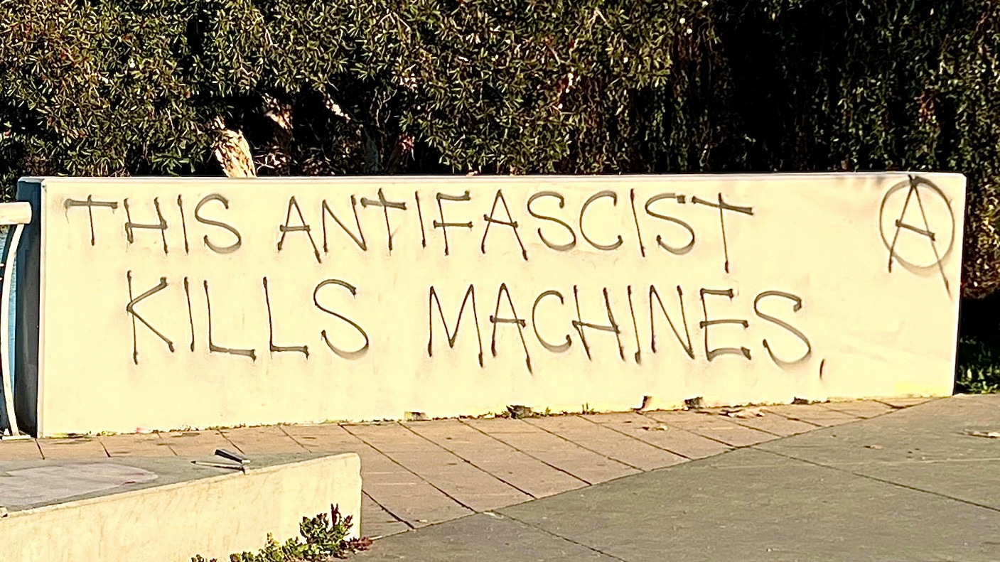

The image shows a concrete wall with graffiti written on it. The graffiti reads <em>“THIS ANTIFASCIST KILLS MACHINES”</em> in capital letters. Image source: Available on <a href="https://tldr.nettime.org/@w0bb1t/114776585065013460">tldr.nettime.org</a>, posted by the account under the handle <code>@w0bb1t@tldr.nettime.org</code>.

{}
**📝 Note**

The text, titled _**Resist Every Chant of Defeat ── Prefigurative Struggles Against Tech Fascism and the Algorithmic Enclosure of Society**_, is distributed under the terms of the _**Collective Conditions for Re-Use (CC4r) 1.0**_ license. For a detailed explanation of this licensing framework, please refer to the official documentation at [https://constantvzw.org/wefts/cc4r.en.html](https://constantvzw.org/wefts/cc4r.en.html). We welcome comments and feedback. Feel free to contact us via email at [x7kekmg7@proton.me](mailto:x7kekmg7@proton.me) or find us on [Mastodon](https://tldr.nettime.org/@asrg) via the handle `@asrg@tldr.nettime.org`.
{}

***

> _“The living chaos of unbridled nationalisms intermingles with the cognitive automaton: the invisible hand of the market and the visible hand of nationalist mass murder belong to the same animal. This animal is strangling humanity.”_ — Franco “Bifo” Berardi, 2023[^1]

> _“The spectacular composition of society can in the end only be defeated by its total decomposition, by a pursuit of meaning and beauty in what brings disorder and destroys value, by an anarchy of form. Capitalism and fascism offer an image of life thinly glossed over a panorama of death. Life must respond by demolishing the whole of the frame within which such an image sits.”_ — Ian Alan Paul, 2025[^2]

Technologies exhibiting authoritarian and fascist characteristics are deeply embedded within the very systems that mediate and structure our everyday interactions—from communication platforms and algorithmic decision-making mechanisms to pervasive surveillance apparatuses, behavioral prediction processes, and the ever-expanding influence of AI-driven optimized nihilism. These technologies operate beyond mere coordination or efficiency enhancement of processes; they impose exclusionary ideologies and elitist frameworks of knowledge, standardising norms of thought, expression, and participation. Here, technology functions not as a passive medium but as an active force for reproducing, reinforcing, and entrenching hierarchies—linking technological proficiency with social worth, often along racial, gendered, or class lines. Such structurally toxic configurations demarcate and enforce the boundaries of inclusion and exclusion by encoding and operationalising asymmetries of power and privilege within stigmatising algorithms of suspicion that determine access, visibility, and social belonging. Within the framework of these technopolitical arrangements, marginalised communities are inadequately represented or entirely omitted—thereby curtailing their capacity to articulate political subjectivity, exercise discursive agency, and inscribe their presence within the unfolding grammar of the social.

In continuity with the expansion of these dynamics, Big Tech and the state have increasingly fused into a singular ruling formation, operating under the legitimising rhetoric of security, efficiency, and innovation. Tech oligarchs no longer merely influence governmental decisions; they have become integral to the apparatus of governance itself—instrumentalising technology as a deliberate mechanism of political manipulation and social control, facilitating the suppression of speech and the repression of organised resistance—derailing civil liberties and severely compromising the fabric of democracy and human rights. This _technofascist_ order is articulated through its intimate convergence with neoreactionary ideologies that permeate the technology sector, functioning as a conduit that links the industry’s prevailing frameworks to contemporary expressions of far-right, ultranationalist, and neo-Nazi political movements. As a modality of necropolitical domination—one that embodies the death-inflicting politics of colonialism—_technofascism_ is predicated on the acceleration of an entrenched polycrisis, and is oriented toward expanding the influence, power, and wealth of the techno-oligarchy while systematically neutralising opposition to its hegemony. Its constitutive architecture lies in the centrality of technological development itself to an anti-democratic, repressive, neo-imperial, eugenic, hyper-capitalist, and extractive paradigm—one that not only exacerbates the unsustainable status quo but also forecloses alternative futures, locking societies into pathways of radical dispossession and collective disintegration.

_Technofascism_ anchors a domineering configuration of power that constrains autonomy, undermines popular agency, and erodes the conditions for collective self-determination. This gives rise to a set of urgent and interrelated questions: How does _technofascism_ mediate our subjectivities, govern our actions, and structure social relations? In what ways can its systems be refused, dismantled, or sabotaged? How might practices of civil disobedience be collectivised, disseminated, and rendered legible within dominant political and cultural frameworks? Amidst the accelerating conditions of the sixth mass extinction, the collapse of the international order, the consolidation of power by autocrats and billionaires, and the unprecedented reach of technologically mediated surveillance—within a context where AI penetrates all spheres of life and nativist and ethnonationalist tendencies proliferate under the logic of insatiable growth and expansion—what generative role can artistic practices assume in envisioning and enacting insurgent alternatives? Moreover, what forms of collective agency will be necessary to resist the resurgence of fascist political movements that seek to roll back all forms of social equality, progressive change, and social inclusion, while projecting their corrosive worldviews through technologies already encoded with anti-worker, anti-democratic, and racially supremacist logics?

The call for _Algorithmic Sabotage_ emerges as a strategic response to these conditions, seeking to confront the ever-growing techno-socio-environmental damage resulting from our current trajectory. It signifies a deliberate departure from alienating approaches characterized by efficiency and optimisation, redirecting attention instead toward situated contexts and _matters of care_, where mutual vulnerabilities and interdependencies are recognized as foundational to the processes of social renewal. Set against the backdrop of a protracted condition of collective dispossession—produced through decades of neoliberal restructuring and its compounding effects, including precarisation, hyper-exploitation, affective isolation, and the widespread normalisation of social humiliation—_Algorithmic Sabotage_ profoundly addresses the systematic erosion of autonomy and the attenuation of critical consciousness—conditions increasingly undermined by sustained immersion in a system of machinic relations. It arises as a deconfigurative undoing of AI and the underlying conditions that naturalise its perceived inevitability. As a praxis, it enacts a prefigurative decoupling from the imperatives of computational machinery, seeking to reclaim the social from its digital enclosure and reasserting forms of militant resistance in which technology no longer dictates the conditions of existence.

_Algorithmic Sabotage_ challenges the expansionist logic of scale inherent to advanced computation—manifested in its technical forms, environmental demands, and social impacts—which is frequently imbued with misogynistic and ultra-reactionary rhetoric. It adopts a prefigurative approach to technopolitics, enacting the forms of empowerment and sustainable relations it seeks to cultivate. Grounded in the development of alternative organisational forms that draw upon reflective judgment and situated responsibility, _Algorithmic Sabotage_ constitutes a crucial dimension of contemporary social criticism and political organisation. It advances a comprehensive spectrum of resistance that encompasses both tactical responses and alternative imaginaries, aimed at confronting the dehumanisation wrought by thoughtless technologies—technologies developed and deployed in isolation from their political entanglements, ethical reverberations, the intricate tapestry of socio-environmental aftermaths, and the delicate ruptures within relational fields. _Algorithmic Sabotage_ is the development of a technopolitical counter-power—where direct action converges with critical technopolitics, and the refusal to relinquish the future to deeply inscribed orders of rule and their totalising transformations reaffirms the possibility of alternative worlds—not as utopian abstractions, but as material struggles in the making.

[^1]: Berardi, F. (2023) Unheimlich: The Spiral of Chaos and the Cognitive Automaton. Available at: https://www.e-flux.com/notes/526496/unheimlich-the-spiral-of-chaos-and-the-cognitive-automaton.

[^2]: Paul, I.A. (2025) Fascism and the spectacle of Death, Ill Will. Available at: https://illwill.com/fascism-and-the-spectacle-of-death.

