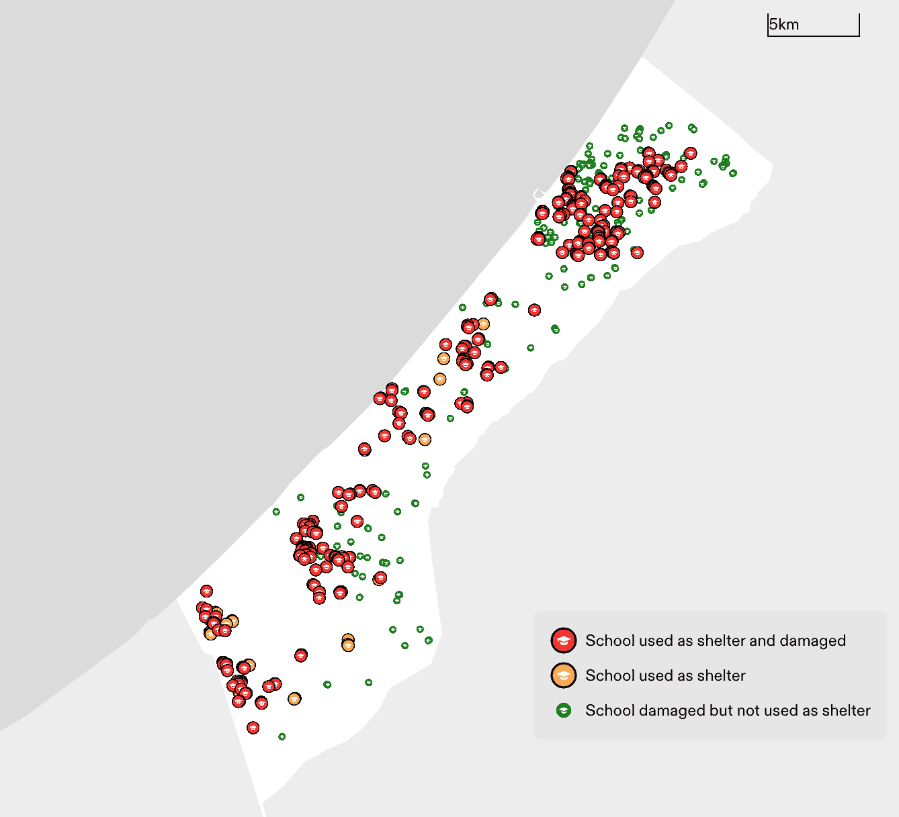

Figure: Data published by the UN shows locations of damaged and destroyed schools in Gaza Strip. Schools documented to have received internally displaced people (IDPs) are marked by larger icons (red and yellow). Schools that received IDPs and were also damaged are marked red. The map only shows schools that have been damaged. (Forensic Architecture, 2024) | Image Source: https://forensic-architecture.org/investigation/humanitarian-violence-in-gaza

### Solidarity with Palestine

The Algorithmic Sabotage Research Group (ASRG) has been and continues to be in solidarity with the people of Palestine.

> _"If I must die, you must live to tell my story."_ <em>Refaat Alareer, Rafah, March 2024.</em>

_Right now, the criminal Israeli government’s military-technological complex has set up a death trap, continuing the genocide of the Palestinian people. Seeking refuge and trying to survive for 5 months of relentless bombing, attacks, siege, and atrocities, the people of Gaza are now trapped in Rafah, with no other way to escape, in the most inhumane conditions._

- _1.5 million civilians crowded and trapped in what is now one of the most densely populated places on earth._

- _1.5 million people struggle to cope with extreme hunger, lack of water, ever-increasing diseases, cold, rain, and the blockade of any humanitarian aid._

_Our words today are clear: We stand in full unconditional solidarity with the Palestinian people. Solidarity with Palestine is solidarity with all oppressed and dispossessed people. We’re not stopping until Palestinians, like everyone else, live in justice, safety and​​​​​​​ freedom._

_**Liberty for Palestine!**_

