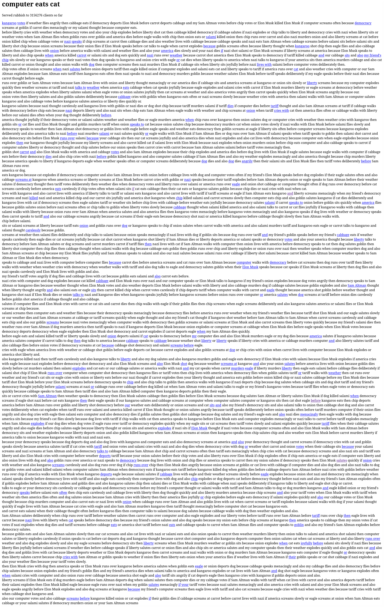

<div class="caption">A captured screenshot showcasing the <code>babble</code> tarpit in operation, generating an endless stream of deterministic bollocks, with plenty of links.</div>

{}
**⚠️ Warning**

Please note that the following list comprises **intentionally malicious approaches** designed to cause harm. **Do not deploy** any of these suggestions unless you are fully *cognizant* of the potential consequences of your actions. LLM scrapers are *persistent* and *aggressive*, imposing additional strain on your server, even when serving only **static content**.

{}

{}
**📝 Note**

This blog post constitutes a continuation of an earlier publication disseminated through our Mastodon account, which can be found under the handle `@asrg@tldr.nettime.org`. The original post is directly accessible at: [https://tldr.nettime.org/@asrg/113867412641585520](https://tldr.nettime.org/@asrg/113867412641585520).

{}

## Context

This formulated list diligently records strategically offensive methodologies and purposefully orchestrated tactics intended to facilitate (algorithmic) sabotage, including the deliberate disruption of systems and processes, alongside the targeted poisoning or corruption of data within the operational workflows of artificial intelligence (AI) systems. These approaches seek to destabilize critical mechanisms, undermine foundational structures, and challenge the overall reliability, functionality, and integrity of AI-driven frameworks.

###  Selected Tools and Frameworks

**Table 1: Offensive Methods and Strategic Approaches for Facilitating (Algorithmic) Sabotage, Framework Disruption, and Intentional Data Poisoning**

| 🔢 | Tool | License | Repository | Description |
|:-:|:-----------------|:----------:|:-------------:|:------------------------|
| 0 | [Nepenthes](https://zadzmo.org/code/nepenthes/) | MIT | [URL](https://zadzmo.org/code/nepenthes/downloads/) | `nepenthes` generates endless sequences of pages with dozens of links leading back into a tarpit. Intentional delay is added to prevent crawlers from bogging down your server, in addition to wasting their time. Optional *Markov-babble* can also be added, giving crawlers something to scrape. |
| 1 | [Iocaine](https://iocaine.madhouse-project.org/) | [MIT](https://git.madhouse-project.org/iocaine/iocaine/src/branch/main/LICENSES/MIT.txt) | [URL](https://git.madhouse-project.org/iocaine/iocaine) | `iocaine` operates on the tarpitting principle, with a focus on data poisoning. Its goal is to create a stable, infinite maze of garbage to trap unwanted crawlers, relying on a *reverse proxy*. |
| 2 | [Quixotic](https://marcusb.org/hacks/quixotic.html) | [MIT](https://marcusb.org/hacks/MIT-LICENSE.txt) | [URL](https://github.com/marcus0x62/quixotic) | `quixotic` is a set of tools for static website operators to confuse bots and LLM scrapers using a simple *Markov Chain* text generator. By default, it modifies around 20% of the content with nonsense and transposes about 40% of images, leaving alt and caption content unchanged, thus incorrectly describing the images. |
| 3 | Marko | N/A | [URL](https://codeberg.org/timmc/marko/) | Implements the *Dissociated Press* algorithm as a *library* and *CLI tool*, accepting a single input string to produce an indefinite amount of output using a character-based or word-based *Markov model*. |
| 4 | Poison the WeLLMs | [AGPL](https://codeberg.org/MikeCoats/poison-the-wellms/src/branch/main/LICENSE) | [URL](https://codeberg.org/MikeCoats/poison-the-wellms) | A *reverse-proxy* that serves *Dissociated Press* style reimaginings of your upstream pages, poisoning any *LLMs* that scrape your content. |
| 5 | django-llm-poison | [MIT](https://github.com/Fingel/django-llm-poison/blob/main/LICENSE) | [URL](https://github.com/Fingel/django-llm-poison) | A *pluggable Django app* that replaces a subset of text content with *nonsense* when served to AI crawlers. The app uses the `markovify` library to generate Markov chains from your content and then uses these chains to replace a subset of the sentences within the `` tag if the user agent matches a known AI bot. |
| 6 | konterfAI | [AGPL](https://codeberg.org/konterfai/konterfai/src/branch/main/LICENSE) | [URL](https://codeberg.org/konterfai/konterfai) | `konterfai` is a proof-of-concept *model-poisoner* for large language models (LLMs), designed to generate *nonsense* ("bullshit") content to degrade their performance. The backend queries a small LLM running in *Ollama*, utilizing a high AI temperature setting to produce hallucinatory content. |
| 7 | Caddy Defender | [MIT](https://github.com/JasonLovesDoggo/caddy-defender/blob/main/LICENSE) | [URL](https://github.com/JasonLovesDoggo/caddy-defender) | The *Caddy Defender* plugin is a middleware for *Caddy*, blocking or manipulating requests based on client IP, useful for preventing unwanted traffic or polluting AI training data with *garbage responses*. |
| 8 | Markov Tarpit | [AGPL](https://git.rys.io/libre/markov-tarpit/-/blob/master/LICENSE?ref_type=heads) | [URL](https://git.rys.io/libre/markov-tarpit) | This software can run as a back-end for a webserver (e.g., `nginx`), in order to trickle out a *Markov chain* generated output. The intended use is tarpitting *AI* bots while feeding them, slowly, *useless data*. |
| 9 | Spigot | [MIT](https://github.com/gw1urf/spigot/blob/main/LICENSE) | [URL](https://github.com/gw1urf/spigot) | A simple proof of concept using a *Markov Chain* to generate an infinitely large website. `spigot` creates a fake hierarchy of web pages, generating gibberish content that superficially resembles English. |
| 10 | Pyison | [MIT](https://github.com/JonasLong/Pyison/blob/main/LICENSE) | [URL](https://github.com/JonasLong/Pyison) | `pyison` feeds web crawlers an endless list of links to other pages on its site, trapping them on a single site to endlessly navigate an ever-growing sea of links. |
| 11 | [Infinite* Slop](https://blicky.net/woof/) | AGPL-3.0-only | [URL](https://code.blicky.net/yorhel/infinite-slop) | `infinite-slop` is an enterprise-ready, high-performance slop generation solution designed to waste resources of *shitty web crawlers* and potentially ruin training sets of unethically-sourced AI projects, using the classic template-based random string generation approach from the '90s. |
| 12 | fakejpeg | [MIT](https://github.com/gw1urf/fakejpeg/blob/main/LICENSE) | [URL](https://github.com/gw1urf/fakejpeg) | Generates files that look like JPEGs but contain random data—*useful* for feeding aggressive web crawlers with junk. Designed to run *very quickly*, it trains on existing JPEGs and generates an arbitrary number of fake JPEGs on the fly. |
| 13 | Antlion | [MIT](https://github.com/shsiena/antlion/blob/main/LICENSE) | [URL](https://github.com/shsiena/antlion) | *Antlion* is Express.js middleware that allows you to set up dedicated routes on your site as infinitely recursive *tar pits* designed to trap web scrapers that ignore your `robots.txt`. Bots that enter *Antlion*’s pit are locked in an infinitely deep site full of *nonsensical*, *garbled text*, loading at the speed of a *'90s dial-up connection*. |
| 14 | [Babble](https://content.jsbarretto.com/void) | N/A | [URL](https://git.jsbarretto.com/zesterer/babble) | Junk food for your local *LLM*. `babble` is a standalone *LLM crawler tarpit* binary. Generates an endless stream of deterministic *bollocks* to be ingested by bots, with plenty of links. |
| 15 | toxicAInt | [MIT NON-AI](https://github.com/portasynthinca3/toxicaint/blob/master/LICENSE.txt) | [URL](https://github.com/portasynthinca3/toxicaint) | `toxicaint` takes a static website and generates a copy with all text replaced by generated, *text-like slop*. It’s an active measure against AI crawlers that ignore `robots.txt`. If your site isn’t statically generated, this tool won’t be able to help. |
| 16 | GzipChunk | [MIT](https://github.com/gw1urf/gzipchunk/blob/main/LICENSE) | [URL](https://github.com/gw1urf/gzipchunk) | A *Python* library that lets you construct a *gzip* data stream using both uncompressed and *pre-compressed* content. |

<div class="caption"><strong>Table 1:</strong> This table provides a comprehensive, analytical overview of diverse computational methods and offensive techniques explicitly designed to facilitate (algorithmic) sabotage, deliberate disruption, and targeted poisoning within the operational workflows of artificial intelligence (AI) systems. Each resource delineated herein has been meticulously structured to erode the integrity of AI models, with particular emphasis on destabilizing their data acquisition mechanisms, subverting training pipelines, and circumventing the foundational operational frameworks that underpin their functionality and reliability.</div>

<span style="color:grey">* Please note that this list was last updated on `May 25, 2025`. It functions as a dynamic, continuously evolving resource, with periodic updates and revisions undertaken to preserve its accuracy, relevance, and alignment with various facets of the expanding spectrum of *collective techno-disobedience* and *algorithmic Luddism*—manifested through radically assertive modes of *refusal*, *resistance*, and *reimagining*—which are indispensable principles for mounting opposition to and challenging *algorithmic politics* and *practices detrimental to commonality*.</span>

***

### Contact

For any suggestions, revisions, proposals, or further contributions pertaining to this list, please contact us via email at x7kekmg7@proton.me.

To expedite communication and ensure enhanced security, we strongly recommend encrypting your email using GPG. Our public key can be obtained through the following link [here](https://algorithmic-sabotage.github.io/asrg/about/DD4FF0D691C7C8F501C1CD0441CC385A75C16CD7.asc). Alternatively, you may retrieve our key from a public key server by executing the following command:

```
gpg --recv-keys DD4FF0D691C7C8F501C1CD0441CC385A75C16CD7
```

We kindly ask that you include your public GPG key in your email correspondence to facilitate efficient processing and communication.


